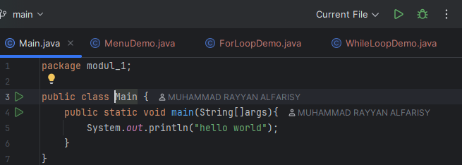
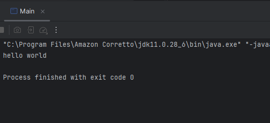
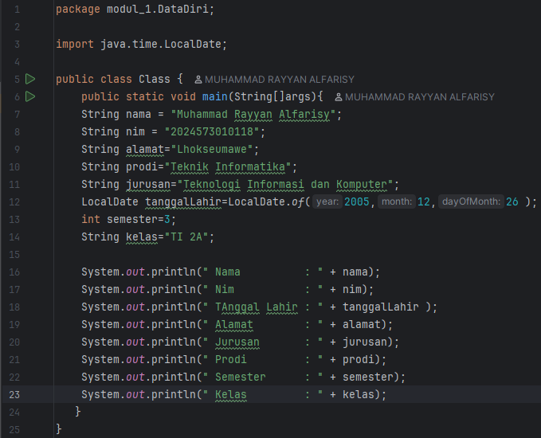
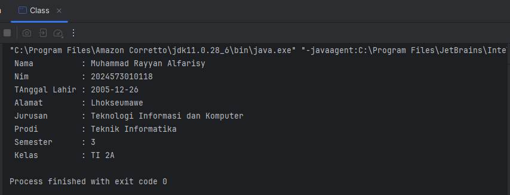
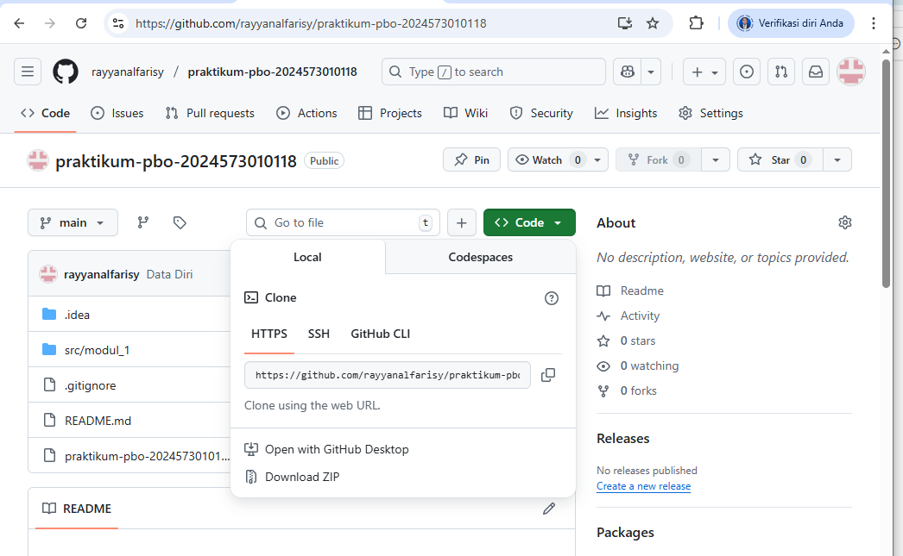

# Laporan Modul 1: Perkenalan Java dan Ekosistemnya
**Mata Kuliah:** Praktikum Pemrograman Berorientasi Objek   
**Nama:** MUHAMMAD RAYYAN ALFARISY  
**NIM:** 2024573010118
**Kelas:** TI 2A

---

## Abstrak
Laporan ini membahas Modul 1 yang berfokus pada Course Introduction & Lab Setup dalam Praktikum Pemrograman Berorientasi Objek. Praktikum meliputi pengenalan paradigma Pemrograman Berbasis Objek (OOP), alasan menggunakan Java, serta persiapan lingkungan kerja: instalasi JDK (Amazon Corretto), instalasi IntelliJ IDEA Community Edition sebagai IDE, setup variabel lingkungan untuk Java, pembuatan repositori Git/GitHub, dan uji coba program sederhana “Hello World”. Tujuan laporan ini adalah mendokumentasikan proses persiapan lingkungan pengembangan Java agar mahasiswa siap melakukan pengembangan program berbasis objek di modul-selanjutnya.

---

## 1. Pendahuluan

Java Development Kit (JDK) adalah paket software yang menyediakan compiler, library, dan runtime yang diperlukan untuk membuat dan menjalankan program Java. Amazon Corretto adalah distribusi JDK open source dari Amazon yang memberikan dukungan jangka panjang (Long Term Support), stabil dan cocok digunakan dalam lingkungan pembelajaran maupun produksi.

---

## 2. Proses instalasi Java

1.Buka browser dan akses situs Amazon Corretto.

2.Pilih versi JDK yang sesuai (disarankan Corretto 17 atau 21).

3.Pilih file installer sesuai sistem operasi (Windows, macOS, Linux).

4.Download installer dan jalankan instalasi.

5.Catat lokasi instalasi.

6.Verifikasi instalasi dengan perintah java -version dan javac -version.

7.Apabila menggunakan Windows, set JAVA_HOME dan tambahkan path ke %JAVA_HOME%\bin di environment variables.

---

## 3. Laporan proses pembuatan program hello world dengan java
Java adalah bahasa pemrograman berorientasi objek yang bersifat platform independent. Semua program Java dieksekusi melalui Java Virtual Machine (JVM). Program “Hello World” adalah program sederhana yang digunakan untuk menguji apakah lingkungan pemrograman sudah siap.
Struktur minimal program Java:

Deklarasi nama kelas (class).

Metode main() sebagai titik awal eksekusi.

Perintah System.out.println() untuk menampilkan teks ke layar

hasilnya:

## 4. Laporan Proses Pembuatan Program Data Diri Dengan Java
Untuk menampilkan teks ke layar, digunakan perintah System.out.println(). Program data diri merupakan contoh sederhana pemanfaatan sintaks Java untuk mencetak informasi pribadi.pertama buat packcage bernama Datadiri lalu buat file class kemudian ketik kode berikut:

hasilnya:

## 5. Praktikum 3: Persiapan Repository Projek
1.Install git jika belum ada (https://git-scm.com/)

2.Buatkan akun github (jika belum ada). https://github.com/

3.Buatkan sebuah repository baru dengan nama praktikum-pbo-<nim anda>. Jangan lupa checklist readme di klik, untuk membuat file readme di repo.

4.Tentukan direktori dimana anda akan menyimpan projek matakuliah ini, kemudian buka git bash dan masuk ke direktorinya dengan perintah cd <nama direktori>

5.Clone project tersebut dengan perintah git clone <url repositori>. Untuk url repositori, anda bisa dapatkan di repositori github anda. contoh nya seperti berikut:

6.Buka project yang sudah anda clone diatas dengan Intellj.
setelah membuat project push project yang telah dibuat ke github masing-masing kemudian commit code anda dengan perintah:

git add .

git commit -m "modul1-perkenalan-java"

git push

---

## 4. Referensi
Mohd Rzu – Modul Praktikum Pemrograman Berorientasi Objek Java (HackMD)
https://hackmd.io/@mohdrzu/ByrYifVFeg
JetBrains – IntelliJ IDEA Community Edition Guide
https://www.jetbrains.com/idea/ 
---
