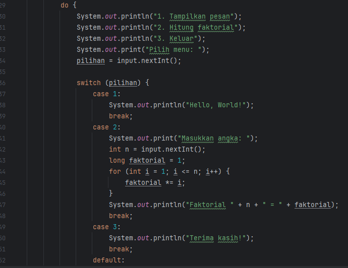

# Laporan Modul 2: Dasar Pemrograman Java
**Mata Kuliah:** Praktikum Pemrograman Berorientasi Objek   
**Nama:** MUHAMMAD RAYYAN ALFARISY
**NIM:** 2024573010118
**Kelas:** TI 2A

---

## 1. Abstrak
Modul 2 “Dasar Pemrograman Java” bertujuan untuk memperkenalkan konsep fundamental pemrograman dengan bahasa Java, meliputi variabel & tipe data, operasi input & output menggunakan Scanner, struktur kontrol percabangan, dan perulangan. Praktikum dilakukan dengan latihan langsung untuk mengimplementasikan teori melalui kode Java, diakhiri dengan analisa hasil dan refleksi pembelajaran. 

---
## 2. Praktikum
### Praktikum 1 - Variabel dan Tipe Data
#### Dasar Teori
Variabel dan Tipe Data
Dalam bahasa Java, variabel adalah tempat untuk menyimpan data yang memiliki tipe tertentu. Java memiliki tipe data primitif seperti byte, short, int, long, float, double, boolean, dan char yang digunakan untuk menyimpan nilai sederhana. Selain itu terdapat juga tipe data referensi seperti String dan array yang digunakan untuk menyimpan data yang lebih kompleks. Penamaan variabel harus mengikuti aturan tertentu seperti tidak diawali angka, tidak menggunakan kata kunci Java, dan bersifat case sensitive. Pemahaman tentang tipe data dan variabel sangat penting karena menentukan bagaimana data dikelola dan diproses dalam program.
#### Langkah Praktikum
1.Buat package baru modul_2 di dalam folder src.

2.Buat file VariabelDemo

3.Deklarasikan berbagai variabel dengan tipe data berbeda (misalnya int, double, boolean, char, String).

4.Cetak isi variabel ke konsol.
#### Screenshoot Hasil

hasilnya:

#### Analisa dan Pembahasan
Pada praktikum ini terlihat bahwa setiap tipe data di Java memiliki karakteristik dan batasan tertentu. Variabel bertipe int hanya dapat menyimpan bilangan bulat dalam rentang tertentu, sedangkan double dapat menyimpan angka desimal. Tipe data boolean hanya menampung nilai benar atau salah, dan char menyimpan satu karakter tunggal. Ketika program dijalankan, hasil output menunjukkan nilai setiap variabel sesuai dengan tipe data yang dideklarasikan. Percobaan ini memperkuat pemahaman bahwa pemilihan tipe data yang tepat penting agar program berjalan efisien dan tidak terjadi kesalahan saat pengolahan data.

### Praktikum 2 - Input Output dan Scanner
#### Dasar Teori

Java menyediakan berbagai cara untuk melakukan input dan output, salah satunya dengan memanfaatkan class Scanner dari package java.util. Class ini memungkinkan program membaca berbagai jenis input dari pengguna seperti integer, double, boolean, maupun string. Metode yang sering digunakan adalah nextInt(), nextDouble(), nextBoolean(), next(), dan nextLine(). Pemilihan metode yang tepat akan memastikan data yang dibaca sesuai tipe yang dibutuhkan. Pemahaman tentang input dan output ini penting agar program dapat berinteraksi dengan pengguna secara efektif.
#### Langkah Praktikum
1.Import class Scanner di Java: import java.util.Scanner;

2.Buat file InputOutputDemo.java.

3.Buat instance Scanner (misal Scanner input = new Scanner(System.in);).

4.Baca input pengguna untuk beberapa tipe data, lalu tampilkan kembali ke pengguna.
#### Screenshoot Hasil

hasilnya:

#### Analisa dan Pembahasan
Percobaan input-output menggunakan class Scanner menunjukkan bagaimana program Java dapat berinteraksi dengan pengguna. Dengan memanfaatkan metode nextInt(), nextDouble(), next() dan nextLine(), program dapat menerima berbagai macam data. Pada saat pengujian, ketika input yang diberikan tidak sesuai dengan tipe data yang diminta, program menghasilkan error sehingga dibutuhkan penanganan kesalahan (error handling). Percobaan ini membuktikan bahwa pemahaman terhadap metode Scanner dan tipe data input sangat penting agar program lebih stabil dan tidak mudah crash.

### Praktikum 3 - Struktur Kontrol: Percabangan
#### Dasar Teori

Dalam praktikum ini digunakan struktur if–else dan switch untuk memproses keputusan berdasarkan kondisi tertentu. Hasil uji menunjukkan bahwa if–else cocok untuk kondisi kompleks dengan banyak logika, sedangkan switch lebih sederhana dan mudah dibaca untuk banyak pilihan yang terdefinisi jelas. Program grade menunjukkan hasil berbeda tergantung skor yang dimasukkan, dan menu switch berjalan lancar sesuai pilihan pengguna. Analisa ini menunjukkan pentingnya memilih struktur percabangan yang tepat agar kode lebih efisien, mudah dipelihara, dan hasil program sesuai harapan.
#### Langkah Praktikum

3.1 Eksperimen If–Else Sederhana

Buat file IfElseDemo.java.

Tulis program untuk mengecek apakah angka yang dimasukkan pengguna adalah bilangan genap atau ganjil.

Jalankan program, amati output untuk beberapa input berbeda.
#### Screenshoot Hasil

3.2 Eksperimen If–Else If–Else (Multi Kondisi)

Buat file GradeDemo.java.

Tulis program untuk menentukan nilai huruf (A, B, C, D, E) berdasarkan skor yang dimasukkan pengguna.

Uji dengan beberapa skor (misalnya 90, 75, 60) untuk melihat hasil berbeda.
#### Screenshoot Hasil

3.3 Eksperimen Switch–Case

Buat file MenuDemo.java.

Buat program yang menampilkan menu sederhana:

1. Lihat Data
2. Tambah Data
3. Hapus Data
4. Keluar

Gunakan switch untuk mengeksekusi tindakan berdasarkan menu yang dipilih pengguna.

Jalankan program dan amati perbedaan setiap pilihan menu.
#### Screenshoot Hasil

3.4 Eksperimen Nested If (If Bersarang)

Buat file NestedIfDemo.java.

Buat program yang menentukan kategori usia (misalnya “Anak”, “Remaja”, “Dewasa”) berdasarkan usia dan status tertentu (misalnya apakah pelajar atau pekerja).

Jalankan program untuk melihat bagaimana nested if memproses kondisi lebih kompleks.

Penggunaan Ternary Operator (Opsional)
#### Screenshoot Hasil

#### Analisa dan Pembahasan
Dalam praktikum ini digunakan struktur if–else dan switch untuk memproses keputusan berdasarkan kondisi tertentu. Hasil uji menunjukkan bahwa if–else cocok untuk kondisi kompleks dengan banyak logika, sedangkan switch lebih sederhana dan mudah dibaca untuk banyak pilihan yang terdefinisi jelas. Program grade menunjukkan hasil berbeda tergantung skor yang dimasukkan, dan menu switch berjalan lancar sesuai pilihan pengguna. Analisa ini menunjukkan pentingnya memilih struktur percabangan yang tepat agar kode lebih efisien, mudah dipelihara, dan hasil program sesuai harapan.

---
### Praktikum 4 - Struktur Kontrol: Perulangan
#### Dasar Teori
Perulangan adalah mekanisme untuk mengeksekusi blok kode secara berulang selama kondisi tertentu terpenuhi. Dalam Java terdapat tiga jenis perulangan utama yaitu for, while, dan do–while. Perulangan for biasanya digunakan ketika jumlah iterasi sudah diketahui, sedangkan while digunakan jika kondisi perlu diperiksa sebelum eksekusi blok kode. Do–while menjamin blok kode dijalankan minimal satu kali meskipun kondisi awal bernilai false. Selain itu, Java juga memungkinkan penggunaan perulangan bersarang (nested loop) untuk menjalankan proses yang lebih kompleks. Pemahaman perulangan membantu programmer menulis kode yang efisien dan terstruktur.

#### Langkah Praktikum
4.1 Eksperimen Perulangan For

Buat file ForLoopDemo.java.

Ketik program untuk mencetak angka 1–10 menggunakan perulangan for.

Tambahkan variasi seperti perulangan mundur (decrement) dari 10 ke 1.

Jalankan program, amati hasilnya.

#### Screenshoot Hasil

4.2 Eksperimen Perulangan While

Buat file WhileLoopDemo.java.

Tulis program untuk mencetak angka ganjil dari 1 sampai 20 menggunakan while.

Tambahkan kondisi berhenti berdasarkan input pengguna (misalnya tekan angka tertentu untuk berhenti).

Jalankan program, amati perbedaan kontrol kondisi dibanding for.

#### Screenshoot Hasil

4.3 Eksperimen Perulangan Do–While

Buat file DoWhileDemo.java.

Tulis program yang meminta pengguna memasukkan password hingga benar menggunakan do–while.

Tampilkan pesan “Akses diterima” saat password benar dan “Coba lagi” jika salah.

Jalankan program untuk melihat sifat do–while yang mengeksekusi blok minimal sekali.

#### Screenshoot Hasil

4.4 Eksperimen Nested Loop (Perulangan Bersarang)

Buat file NestedLoopDemo.java.

Gunakan nested loop untuk mencetak pola bintang sederhana (misalnya segitiga).

Kembangkan menjadi pola lain (persegi, segitiga terbalik, dll.) untuk melihat kreativitas.

Jalankan program, amati hasil pola yang terbentuk.

#### Screenshoot Hasil

#### Analisa dan Pembahasan
Hasil percobaan perulangan for, while, dan do–while memperlihatkan bahwa masing-masing memiliki kegunaan spesifik. Perulangan for efektif saat jumlah iterasi diketahui, sedangkan while dan do–while lebih fleksibel untuk kondisi dinamis. Pada do–while, meskipun kondisi awal salah, program tetap menjalankan blok kode minimal sekali sesuai sifatnya. Percobaan nested loop berhasil membentuk pola dan menunjukkan bahwa semakin dalam tingkat perulangan maka semakin besar pula kompleksitas eksekusi program. Dari sini dapat dianalisa bahwa pemahaman struktur perulangan membantu pengembang menulis program yang lebih efisien dan mudah dikendalikan alur eksekusinya.

## 3. Kesimpulan
``
Berdasarkan praktikum Modul 2 Dasar Pemrograman Java dapat disimpulkan bahwa pemahaman konsep dasar seperti variabel, tipe data, input dan output, percabangan, serta perulangan merupakan fondasi penting dalam membangun program Java yang baik. Melalui percobaan variabel dan tipe data, mahasiswa belajar memilih tipe data yang sesuai agar pengolahan data menjadi lebih efisien. Pada percobaan input dan output menggunakan class Scanner, mahasiswa memahami cara berinteraksi dengan pengguna serta pentingnya penanganan kesalahan input. Struktur percabangan if–else dan switch membantu mahasiswa membangun logika pengambilan keputusan yang lebih jelas dan terstruktur, sedangkan perulangan for, while, do–while dan nested loop memperkenalkan cara mengotomatisasi proses berulang. Praktikum ini berhasil meningkatkan keterampilan mahasiswa dalam menerapkan konsep dasar pemrograman Java sehingga mampu membuat program yang interaktif, terstruktur, dan mudah dikembangkan.

---

## 5. Referensi
Duniailkom.
Tutorial Belajar Java: Tipe Data Array dalam Bahasa Pemrograman Java.
Diakses dari: https://www.duniailkom.com/tutorial-belajar-java-tipe-data-array-bahasa-pemrograman-java/

Petani Kode.
Belajar Java: Mengenal Array di Java.
Diakses dari: https://www.petanikode.com/java-array/

W3Schools.
Java Methods and Strings Tutorial.
Diakses dari: https://www.w3schools.com/java/

---
