# Laporan Modul 3: Dasar Pemrograman Java
**Mata Kuliah:** Praktikum Pemrograman Berorientasi Objek   
**Nama:** MUHAMMAD RAYYAN ALFARISY
**NIM:** 2024573010118
**Kelas:** TI 2A

---

## 1. Abstrak
---
Modul ini membahas penerapan konsep dasar lanjutan dalam bahasa pemrograman Java, yaitu array, method, dan string. Ketiga konsep ini merupakan pondasi penting dalam pemrograman berorientasi objek, khususnya dalam pengelolaan data, modularisasi program, dan manipulasi teks.Tujuan dari praktikum ini adalah agar mahasiswa mampu memahami dan menerapkan penggunaan array dalam berbagai bentuk, menguasai konsep modularisasi melalui method, serta dapat mengelola dan memanipulasi string secara efisien. Melalui kombinasi ketiga konsep ini, mahasiswa diharapkan dapat menulis program yang lebih sistematis, terstruktur, dan mudah dikembangkan untuk kebutuhan aplikasi yang lebih kompleks.
## 2. Praktikum
### Praktikum 1 - Array
#### 1.1 Array satu dimensi
#### Dasar Teori
Tipe data array adalah tipe data yang terdiri dari kumpulan tipe data lain. Dalam bahasa Indonesia, array dikenal juga dengan istilah Larik. Dengan array, proses penyimpanan data ke dalam variabel menjadi lebih efisien dan mudah, terutama jika memiliki data dalam jumlah banyak.
Anggota atau isi dari array itu sendiri harus satu jenis tipe data, misalkan terdiri dari kumpulan angka bulat saja (integer), kumpulan karakter saja (char), maupun kumpulan angka pecahan saja (double). Di dalam bahasa Java, kita tidak bisa membuat 1 array dengan berbagai tipe data (harus 1 jenis saja).
Dalam Java, pembuatan array terdiri dari tiga tahap utama, yaitu deklarasi, instansiasi, dan inisialisasi. Deklarasi digunakan untuk mendefinisikan variabel array tanpa mengalokasikan ruang penyimpanan
#### Langkah Praktikum
1.Membuat Kelas dan Metode Utama
Buat sebuah kelas bernama arraysatuDimensi di dalam package modul_3.
2.Deklarasi dan Inisialisasi Array
Deklarasikan dua buah array, yaitu array nilai bertipe int untuk menyimpan nilai siswa,
dan array nama bertipe String untuk menyimpan nama siswa.
3.Menampilkan Panjang Array
Gunakan properti .length untuk mengetahui jumlah elemen pada array nilai.
4.Mengakses Elemen Array Tertentu
Akses elemen pertama dari masing-masing array (indeks ke-0) dan tampilkan nilainya
5.Menampilkan Semua Data dengan Perulangan
Gunakan perulangan for untuk menampilkan seluruh nama dan nilai siswa satu per satu.
6.Menjalankan Program dan Mengamati Hasil
Jalankan program menggunakan compiler Java.

#### Screenshoot Hasil
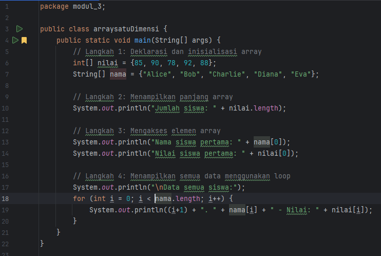

#### 1.2 Array dua dimensi
#### Dasar Teori
Array dua dimensi merupakan bentuk lanjutan dari array satu dimensi yang digunakan untuk menyimpan data dalam format baris dan kolom, menyerupai struktur tabel atau matriks. Dalam bahasa pemrograman Java, array dua dimensi sering disebut sebagai array dari array (array of arrays), karena secara teknis merupakan kumpulan dari beberapa array satu dimensi yang disusun berurutan.Deklarasi array dua dimensi di Java dilakukan dengan menambahkan dua pasang tanda kurung siku [][].Array dua dimensi juga dapat digunakan untuk melakukan berbagai operasi perhitunganseperti mencari rata-rata nilai, menentukan elemen maksimum atau minimum per baris maupun per kolom, dan mengelompokkan data dalam bentuk matriks
#### Langkah Praktikum
1. Membuat Package dan Kelas
Buat package bernama modul3, lalu buat file baru bernama ArrayDuaDimensi.java.
2. Mengimpor Library Scanner
3. Mendeklarasikan Array dan Variabel yang Diperlukan
4. Menginput Data Siswa dan Nilai
Gunakan objek Scanner untuk menerima input nama siswa dan nilai mereka.
Input dilakukan dengan dua perulangan bersarang: perulangan luar untuk siswa dan perulangan dalam untuk mata pelajaran.
5. Menampilkan Data dalam Bentuk Tabel
Setelah semua data diinput, program akan mencetak tabel nilai siswa lengkap dengan rata-rata nilainya
6. Menghitung dan Menampilkan Rata-Rata Nilai
Untuk setiap siswa, program menghitung total nilai empat mata pelajaran, kemudian membaginya dengan 4 untuk mendapatkan rata-rata.
7. Menjalankan Program dan Mengamati Output
Jalankan program di terminal atau IDE Java

#### Screenshoot Hasil
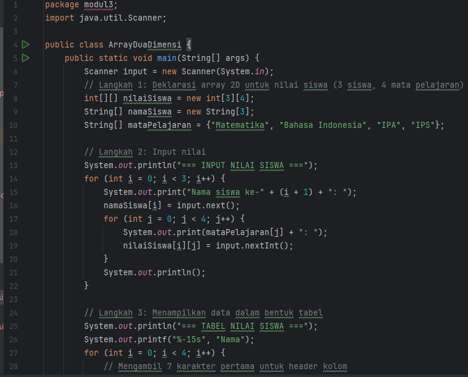

hasilnya:

#### Analisa dan Pembahasan
Pada praktikum ini, dilakukan implementasi konsep array satu dimensi dan array dua dimensi dalam bahasa pemrograman Java. Tujuannya adalah agar mahasiswa memahami cara menyimpan, mengakses, serta menampilkan sejumlah data dengan lebih efisien menggunakan struktur array.
Pada program array satu dimensi, mahasiswa belajar mendeklarasikan dan menginisialisasi array bertipe int dan String untuk menyimpan data nilai serta nama siswa. Data disusun dalam urutan indeks mulai dari 0 hingga length - 1. Melalui perulangan for, seluruh elemen array dapat diakses dan ditampilkan secara sistematis. Program juga menggunakan properti .length untuk mengetahui jumlah elemen array secara dinamis, sehingga kode lebih fleksibel ketika ukuran data berubah. Dari hasil uji coba, program berhasil menampilkan seluruh data siswa beserta nilainya dalam urutan yang benar tanpa perlu membuat banyak variabel secara manual. Hal ini menunjukkan bahwa array sangat efisien untuk menyimpan banyak data yang sejenis.
Sementara itu, pada program array dua dimensi, konsep array dikembangkan lebih lanjut dengan menggunakan dua indeks, yaitu indeks baris dan indeks kolom. Array dua dimensi digunakan untuk menyimpan data nilai beberapa siswa dalam beberapa mata pelajaran. Proses pengisian data dilakukan menggunakan nested loop (perulangan bersarang) di mana perulangan luar digunakan untuk baris (nama siswa), dan perulangan dalam digunakan untuk kolom (mata pelajaran).
Selain menampilkan data dalam bentuk tabel, program juga menghitung nilai rata-rata tiap siswa menggunakan operasi aritmatika sederhana. Penggunaan perulangan bersarang memungkinkan program membaca dan menampilkan seluruh elemen array 2D secara terstruktur. Format tabel dibuat lebih rapi menggunakan System.out.printf(), yang membantu dalam menyusun tampilan data agar sejajar dan mudah dibaca.
Secara keseluruhan, implementasi array satu dan dua dimensi dalam praktikum ini menunjukkan bahwa array merupakan struktur data yang penting dan efisien dalam pemrograman. Melalui array, pengelolaan data dalam jumlah besar menjadi lebih sederhana, teratur, dan mudah diolah menggunakan perulangan.

### Praktikum 2 - Method
#### Dasar Teori
Dalam bahasa pemrograman Java, method merupakan blok kode yang dirancang untuk menjalankan tugas tertentu dan dapat digunakan berulang kali di berbagai bagian program. Konsep method ini termasuk dalam prinsip modularisasi, yaitu cara memecah program besar menjadi bagian-bagian kecil yang lebih mudah dikelola. Dengan menggunakan method, programmer dapat menulis kode yang lebih terstruktur, mudah dipelihara, dan menghindari pengulangan instruksi yang sama. Sebuah method biasanya memiliki nama, tipe pengembalian nilai (return type), parameter (opsional), dan blok perintah yang berada di dalam kurung kurawal {}. Method dapat dipanggil dari method lain, termasuk dari method main(), untuk mengeksekusi fungsinya.
Secara umum, terdapat dua jenis method di Java, yaitu method void dan method non-void.Method void tidak mengembalikan nilai.Method ini hanya menampilkan pesan tanpa menghasilkan output nilai balik.Method non-void atau return method digunakan ketika diperlukan nilai keluaran. Nilai dikembalikan dengan perintah returnMethod tersebut akan mengembalikan hasil penjumlahan yang bisa disimpan atau ditampilkan oleh pemanggil method.

Selanjutnya, dalam konteks pengolahan data, Java memungkinkan penggunaan method yang berhubungan dengan array atau sering disebut method array. Method array digunakan untuk memproses, menghitung, atau menampilkan elemen-elemen dalam array. Dengan membuat method khusus yang menangani array, program menjadi lebih modular dan mudah dikembangkanSecara konseptual, penggunaan method dalam array mencerminkan prinsip reusability (kode dapat digunakan kembali) dan encapsulation (kode dibatasi dalam fungsi tertentu). Dengan menggabungkan array dan method, pemrogram dapat membuat sistem pengolahan data yang kompleks dengan cara yang sederhana dan efisien.
#### 2.1 Langkah Praktikum 
1. Membuat Package dan Kelas
Buat sebuah package bernama modul_3, kemudian buat file baru bernama MethodDasar.java.
2. Membuat Method Void Tanpa Parameter
Buat method tampilkanHeader() yang menampilkan judul program kalkulator sederhana di layar.
Method ini tidak memiliki parameter dan tidak mengembalikan nilai (void).
3. Membuat Method Void dengan Parameter
Buat method tampilkanHasil(String operasi, double a, double b, double hasil)
untuk menampilkan hasil operasi matematika dengan format yang rapi menggunakan printf().
Method ini menerima empat parameter yang digunakan untuk menampilkan jenis operasi dan hasil perhitungannya.
4. Membuat Method dengan Return Value (Nilai Kembalian)
Buat empat method berbeda untuk melakukan operasi aritmatika dasar: penjumlahan, pengurangan, perkalian, dan pembagian.
Masing-masing method menerima dua parameter bertipe double dan mengembalikan hasil perhitungan.
5. Membuat Method untuk Validasi Input
Tambahkan method validasiAngka(double angka) untuk memastikan nilai yang dimasukkan valid
(tidak bernilai NaN atau tidak terhingga).
Method ini mengembalikan nilai true jika data valid, dan false jika tidak.
6. Memanggil Semua Method di Fungsi main()
Dalam method main(), deklarasikan dua buah variabel x dan y bertipe double untuk menampung dua nilai yang akan dihitung.
Panggil tampilkanHeader() untuk menampilkan judul program, kemudian lakukan validasi menggunakan validasiAngka().
Jika valid, lakukan operasi aritmatika dengan memanggil method tambah(), kurang(), kali(), dan bagi(), lalu tampilkan hasilnya menggunakan tampilkanHasil().
7. Menjalankan Program dan Mengamati Hasil
Jalankan program di terminal atau IDE
#### Screenshoot Hasil
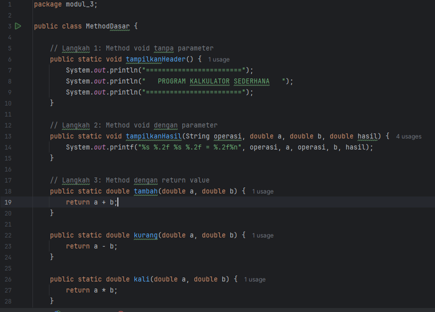
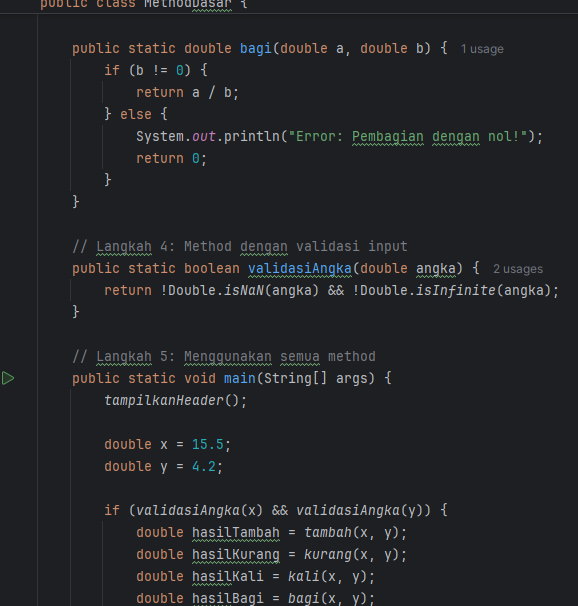
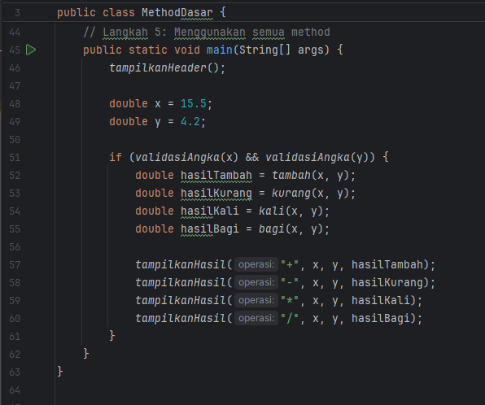
#### 2.2 Langkah Praktikum
1. Package dan Kelas Program
Buat package bernama modul3, kemudian buat file baru bernama ArrayMethod.java.
2. Menambahkan Library Scanner
Impor kelas Scanner dari pustaka java.util untuk memungkinkan pengguna memasukkan data melalui keyboard
3. Membuat Method untuk Input Array
   Buat method inputArray() yang meminta pengguna memasukkan sejumlah angka dan menyimpannya ke dalam array.
   Method ini mengembalikan array bertipe int
4. Membuat Method untuk Menampilkan Array
   Buat method tampilkanArray() untuk mencetak seluruh isi array dalam format [elemen1, elemen2, ...].
   Method ini tidak mengembalikan nilai (void)
5. Membuat Method untuk Mencari Nilai Maksimum dan Minimum
   Method cariMaksimum() mencari nilai terbesar dalam array.
   Method cariMinimum() mencari nilai terkecil dalam array.
   Keduanya menggunakan perulangan for untuk membandingkan elemen satu per satu.
6. Membuat Method untuk Menghitung Rata-Rata
   Buat method hitungRataRata() yang menghitung jumlah seluruh elemen array dan membaginya dengan panjang array (array.length
7. Membuat Method untuk Mengurutkan Array (Bubble Sort)
   Buat method urutkanArray() yang mengurutkan data secara ascending menggunakan algoritma Bubble Sort.
   Method ini mengembalikan array baru agar data asli tidak berubah
8. Menggabungkan Semua Method di Fungsi main()
   Di dalam main(), panggil semua method yang telah dibuat untuk menjalankan seluruh proses
9. Menjalankan Program dan Mengamati Hasil
   Jalankan program melalui terminal atau IDE.
#### Screenshoot Hasil
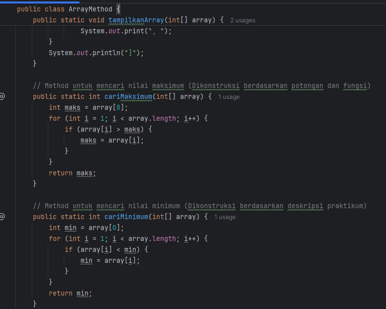
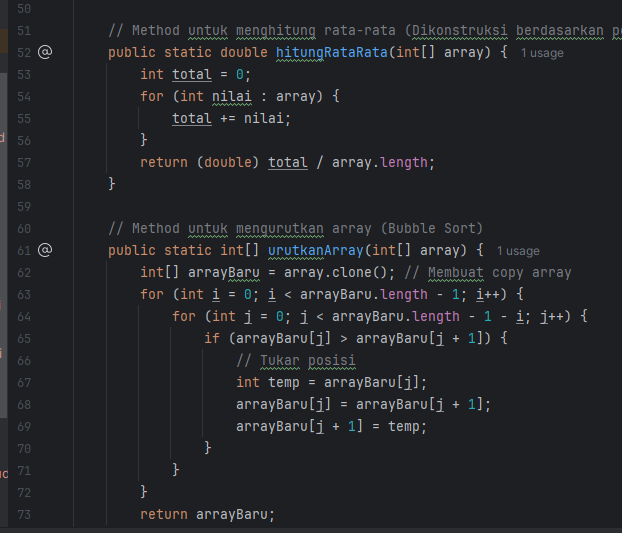
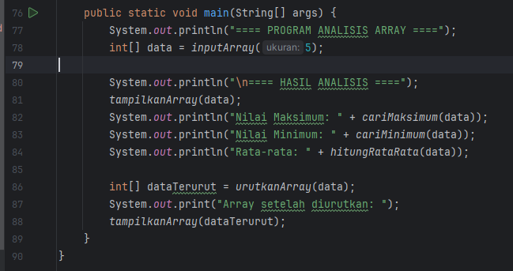

#### Analisa dan Pembahasan
Pada praktikum ini, mahasiswa mempelajari konsep dasar method dalam bahasa pemrograman Java. Method merupakan sekumpulan perintah yang dirancang untuk melakukan tugas tertentu dan dapat digunakan berulang kali di berbagai bagian program. Penerapan method dalam program bertujuan untuk menciptakan kode yang lebih modular, terstruktur, dan efisien, sehingga proses pengembangan dan pemeliharaan program menjadi lebih mudah. Dalam program yang dibuat, mahasiswa menerapkan berbagai jenis method — baik method tanpa parameter, method dengan parameter, maupun method dengan nilai kembalian (return value).
Program yang dibuat merupakan contoh sederhana penerapan method dalam bentuk kalkulator empat operasi aritmatika dasar, yaitu penjumlahan, pengurangan, perkalian, dan pembagian. Empat operasi tersebut didefinisikan dalam method terpisah (tambah(), kurang(), kali(), dan bagi()), yang masing-masing menerima dua parameter bertipe double dan mengembalikan hasil perhitungannya. Dengan cara ini, setiap operasi memiliki tanggung jawab sendiri, sehingga kode menjadi lebih mudah dipahami dan dikelola. Selain itu, program juga memiliki method tambahan seperti tampilkanHeader() yang berfungsi menampilkan judul program, serta tampilkanHasil() yang digunakan untuk menampilkan hasil perhitungan dengan format tertentu menggunakan printf() agar hasil keluaran terlihat rapi.
Salah satu aspek penting dalam program ini adalah penerapan method dengan nilai kembalian (return value) dan method void. Method dengan nilai kembalian digunakan untuk menghasilkan suatu nilai yang dapat diproses kembali oleh bagian lain dari program, contohnya method tambah() yang mengembalikan hasil penjumlahan. Sementara method void digunakan ketika tidak diperlukan nilai balik, seperti pada method tampilkanHeader(). Dengan memahami perbedaan ini, mahasiswa dapat memilih tipe method yang sesuai dengan kebutuhan logika program. Selain itu, program juga menerapkan validasi input melalui method validasiAngka(), yang memastikan nilai masukan tidak bernilai NaN atau infinite, sehingga dapat mencegah kesalahan dalam proses perhitungan.
Hasil pengujian menunjukkan bahwa program dapat menampilkan hasil operasi aritmatika dengan benar dan format yang rapi. Setiap method berjalan sesuai fungsinya, saling berinteraksi melalui pemanggilan di dalam method main(). Program ini menggambarkan pentingnya penggunaan method dalam mengorganisir logika program agar tidak terjadi pengulangan kode (redundancy). Dengan pemisahan fungsi ke dalam method, setiap bagian program dapat diuji dan dikembangkan secara mandiri tanpa mempengaruhi bagian lain.
Secara keseluruhan, praktikum ini menunjukkan bahwa penggunaan method dalam Java memberikan banyak keuntungan dalam hal efisiensi, keterbacaan, dan pemeliharaan kode. Mahasiswa juga belajar bagaimana method berperan sebagai dasar dalam pemrograman berorientasi objek (OOP), karena prinsip yang sama digunakan dalam pembuatan class dan objek. Melalui pemahaman ini, mahasiswa dapat mengembangkan program yang lebih kompleks dan profesional dengan struktur kode yang terorganisir dengan baik.

### Praktikum 3 - String
#### Dasar Teori
Dalam bahasa pemrograman Java, String merupakan salah satu tipe data yang digunakan untuk menyimpan dan memanipulasi kumpulan karakter (teks). Berbeda dengan tipe data primitif seperti int atau double, String termasuk dalam kategori objek karena berasal dari kelas java.lang.String. Hal ini berarti String memiliki banyak method bawaan yang dapat digunakan untuk melakukan berbagai operasi pada data teks. String biasanya digunakan untuk menampung data seperti nama, kalimat, kata sandi, atau informasi lainnya yang berbentuk huruf dan simbol.
Deklarasi sebuah String dapat dilakukan dengan dua cara, yaitu menggunakan literal string atau menggunakan objek dari kelas String.
u keunikan dari String di Java adalah sifatnya immutable, artinya nilai String yang telah dibuat tidak dapat diubah. Setiap kali dilakukan perubahan pada String, Java sebenarnya membuat objek String baru di memori. Oleh karena itu, jika dibutuhkan manipulasi teks yang sering berubah, Java menyediakan kelas tambahan seperti StringBuilder dan StringBuffer yang bersifat mutable atau dapat diubah isinya.

Objek String memiliki banyak method bawaan yang sangat berguna dalam pengolahan teks. Beberapa method yang sering digunakan antara lain:

length() untuk menghitung jumlah karakter dalam string,

toUpperCase() dan toLowerCase() untuk mengubah huruf menjadi kapital atau kecil,

charAt(int index) untuk mengambil karakter tertentu berdasarkan posisi,

substring(int start, int end) untuk memotong bagian tertentu dari teks,

replace(oldChar, newChar) untuk mengganti karakter atau kata dalam string,

contains(String teks) untuk memeriksa apakah teks tertentu terdapat dalam string,

serta equals() atau equalsIgnoreCase() untuk membandingkan dua string secara sensitif atau tidak terhadap huruf besar-kecil.
Dalam dunia pemrograman, penguasaan string sangat penting karena hampir semua aplikasi berinteraksi dengan teks — baik untuk menampilkan pesan, menerima input dari pengguna, membaca file, maupun berkomunikasi dengan database.
#### 3.1Langkah Praktikum 
1. Membuat Package dan Kelas Program
   Buat package bernama modul3, kemudian buat file baru bernama StringDasar.java.
2. Menambahkan Library Scanner untuk Input
   Import library java.util.Scanner agar program dapat menerima masukan dari pengguna
3. Membuat Method analisisString()
   Method ini bertanggung jawab untuk menampilkan berbagai informasi dasar dari sebuah teks, seperti panjang string, huruf pertama dan terakhir, hasil konversi huruf besar-kecil, jumlah kata, dan jumlah huruf vokal.
   Di dalam method ini digunakan beberapa method bawaan dari kelas String, yaitu length(), charAt(), toUpperCase(), toLowerCase(), dan split().
4. Menambahkan Fitur Penghitungan Jumlah Kata dan Huruf Vokal
   Di dalam method analisisString(), teks yang diinput pengguna akan dipecah menjadi kata-kata menggunakan method split("\\s+").
   Kemudian dibuat method tambahan hitungVokal() untuk menghitung jumlah huruf vokal dalam teks
5. Membuat Method untuk Membalik String (reverseString())
   Gunakan kelas StringBuilder dan method reverse() untuk membalikkan urutan karakter dalam string
6. Membuat Method untuk Mengecek Palindrome (isPalindrome())
   Method ini digunakan untuk menentukan apakah teks yang dimasukkan pengguna merupakan palindrome (teks yang sama jika dibaca dari depan maupun belakang).
   Program menghapus karakter non-alfabet menggunakan replaceAll() dan menyamakan huruf dengan toLowerCase() untuk perbandingan
7. Menerapkan Semua Method dalam Fungsi main()
   Di dalam main(), buat objek Scanner untuk menerima input teks dari pengguna.
   Jalankan seluruh method yang telah dibuat: analisisString(), reverseString(), dan isPalindrome().
   Tambahkan juga fitur untuk mencari kata tertentu dalam teks menggunakan method contains() dan indexOf()
8. Menjalankan Program dan Mengamati Output
   Jalankan program, kemudian masukkan sebuah kalimat untuk dianalisis.
   Program akan menampilkan hasil analisis lengkap, teks yang sudah dibalik, hasil pemeriksaan palindrome, dan posisi kata yang dicari.
#### Screenshoot Hasil
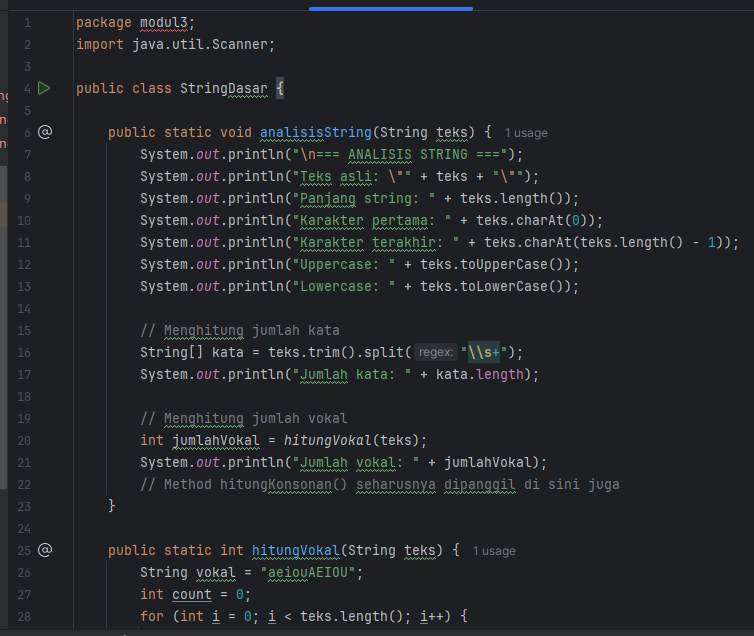
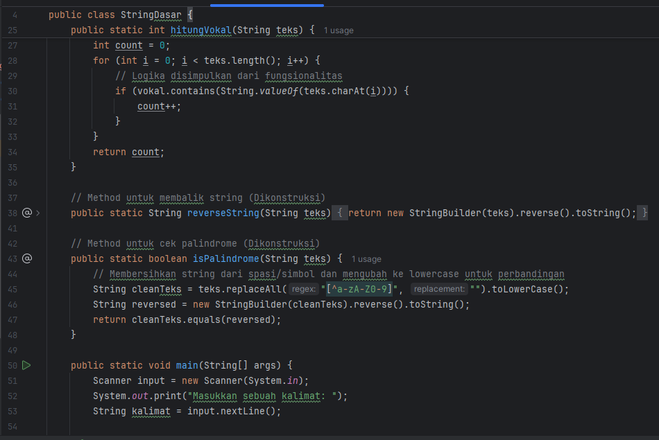
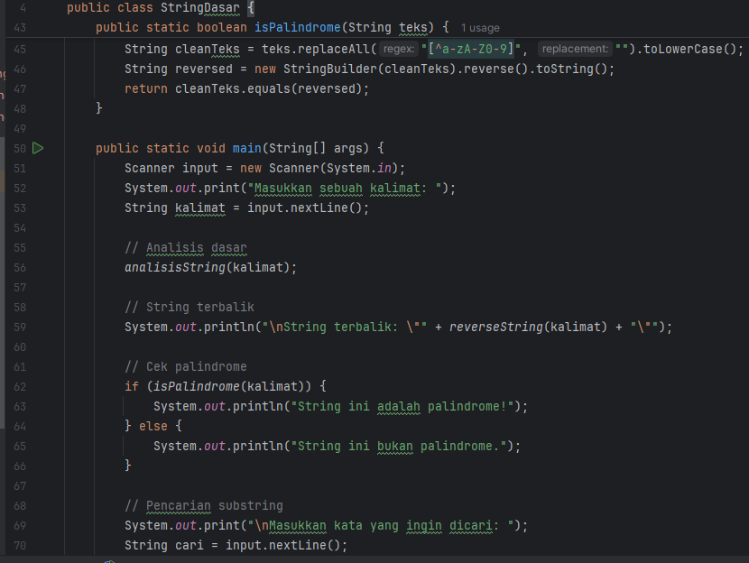
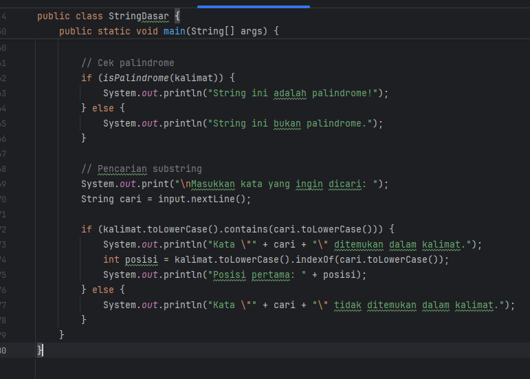
####  3.2Langkah Praktikum
1. Membuat Package dan Kelas Program
   Buat package bernama modul3, kemudian buat file baru dengan nama TextProcessing.java.
2. Menambahkan Library Scanner untuk Input
   Import library java.util.Scanner agar program dapat menerima input dari pengguna
3. Membuat Method prosesDataMahasiswa(String data).
4. Menentukan Nama Terpanjang dan Terpendek
   Dalam method prosesDataMahasiswa(), lakukan perulangan untuk membandingkan panjang setiap nama.
   Gunakan variabel namaTerpanjang dan namaTerpendek untuk menyimpan hasilnya
5. Membuat Method formatTitleCase(String teks)
   Method ini digunakan untuk mengubah setiap kata dalam nama menjadi huruf kapital di awal (format Title Case).
6. Membuat Method buatInisial(String nama)
   Method ini menghasilkan inisial dari nama mahasiswa
7. Menampilkan Hasil Pengolahan Data Mahasiswa
   Setelah semua method dibuat, panggil prosesDataMahasiswa() dari fungsi main().
8. Menjalankan Program dan Mengamati Output
   Jalankan program di terminal atau IDE
#### Screenshoot Hasil
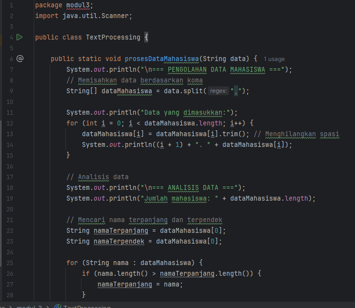
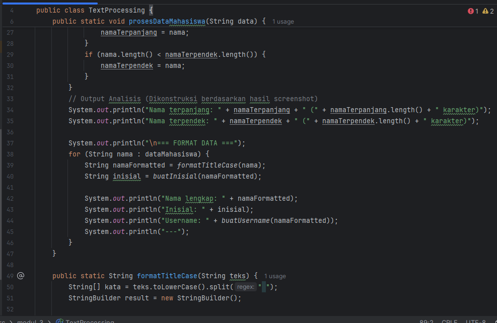
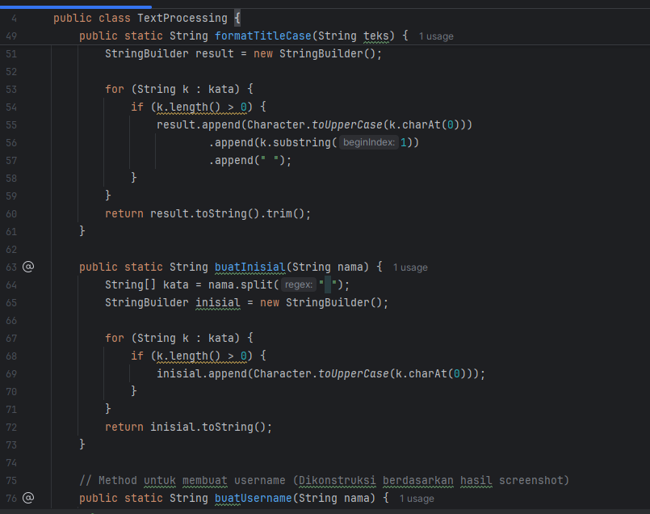
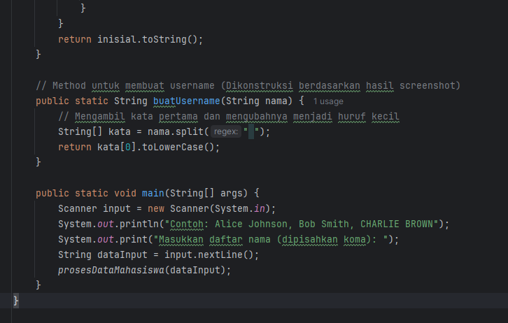

#### Analisa dan Pembahasan

Pada praktikum ini, mahasiswa mempelajari cara memanipulasi dan menganalisis data teks menggunakan kelas String dalam bahasa pemrograman Java. Kelas String merupakan salah satu kelas yang paling sering digunakan karena hampir semua program berinteraksi dengan data berbentuk teks, seperti nama, kalimat, pesan, atau data masukan dari pengguna. Dalam program yang dibuat, mahasiswa memanfaatkan berbagai method bawaan dari kelas String untuk melakukan analisis, pencarian, dan transformasi teks. Melalui latihan ini, mahasiswa dapat memahami bagaimana Java mengelola teks sebagai objek yang memiliki sifat immutable (tidak dapat diubah secara langsung), serta bagaimana menggunakan berbagai operasi string untuk menghasilkan keluaran yang informatif dan terstruktur.
Program dimulai dengan meminta pengguna memasukkan sebuah kalimat, kemudian dianalisis menggunakan method seperti length(), charAt(), toUpperCase(), dan toLowerCase() untuk menampilkan informasi dasar tentang teks. Method length() digunakan untuk menghitung jumlah karakter dalam string, sedangkan charAt() digunakan untuk mengambil karakter tertentu berdasarkan indeks. Dengan toUpperCase() dan toLowerCase(), program dapat mengubah seluruh huruf menjadi kapital atau kecil untuk keperluan analisis tampilan. Selain itu, method split("\\s+") digunakan untuk memisahkan kalimat menjadi kata-kata, sehingga program dapat menghitung jumlah kata dalam input pengguna.
Program juga menambahkan fitur untuk menghitung jumlah huruf vokal melalui perulangan dan pencocokan karakter dengan kumpulan huruf "aeiouAEIOU". Ini menunjukkan bagaimana operasi string dapat dikombinasikan dengan struktur kendali seperti loop untuk analisis karakter. Kemudian, mahasiswa membuat method reverseString() yang memanfaatkan kelas StringBuilder dengan method reverse() untuk membalik urutan karakter dalam teks. Dari hasil pembalikan ini, dilakukan pemeriksaan palindrome, yaitu kondisi ketika teks yang dibaca dari depan dan belakang menghasilkan urutan huruf yang sama. Pemeriksaan dilakukan dengan menghapus karakter non-alfabet menggunakan replaceAll("[^a-zA-Z0-9]", "") dan menyamakan huruf menggunakan toLowerCase() sebelum dibandingkan.
Selain itu, program juga menyediakan fitur pencarian kata tertentu dalam kalimat menggunakan method contains() dan indexOf(). Fitur ini digunakan untuk menentukan apakah kata yang dicari terdapat dalam string dan di posisi mana kata tersebut muncul. Dengan menggabungkan semua method tersebut, mahasiswa dapat memahami bagaimana pengolahan teks dilakukan secara sistematis dan efisien dalam Java, serta bagaimana kombinasi method dapat digunakan untuk menghasilkan program yang interaktif dan informatif.
Dari hasil pengujian, program mampu menampilkan seluruh analisis dengan benar — mulai dari jumlah karakter, jumlah kata, huruf vokal, hasil pembalikan string, hingga deteksi palindrome. Program juga memberikan hasil pencarian kata yang akurat berdasarkan posisi dalam kalimat. Hal ini menunjukkan bahwa kelas String di Java memiliki kemampuan komprehensif dalam memanipulasi data teks tanpa perlu membuat algoritma yang kompleks secara manual.
Secara keseluruhan, praktikum ini membuktikan bahwa pemahaman terhadap kelas String sangat penting bagi pengembang Java karena hampir semua interaksi pengguna dan penyimpanan data melibatkan teks. Mahasiswa dapat belajar bagaimana memanfaatkan berbagai method string untuk pemrosesan data seperti pencarian, pengubahan format huruf, pembersihan teks, hingga analisis struktur kalimat. Penguasaan konsep ini menjadi dasar penting untuk pemrograman tingkat lanjut seperti pengolahan file teks, input-output data, dan pengembangan aplikasi berbasis antarmuka pengguna.

## 3. Kesimpulan
Berdasarkan hasil praktikum yang telah dilakukan dari materi Array, Method, hingga String, dapat disimpulkan bahwa ketiga konsep tersebut merupakan dasar utama dalam pemrograman Java yang saling berkaitan dan membentuk pondasi logika pemrograman yang kuat. Melalui materi Array, mahasiswa memahami bagaimana cara menyimpan dan mengelola sekumpulan data dengan tipe yang sama secara efisien. Array memungkinkan data diakses dan dimodifikasi menggunakan indeks, sehingga sangat berguna dalam pengolahan data berjumlah banyak, seperti daftar nilai, data mahasiswa, atau elemen numerik lainnya.
Selanjutnya, pada materi Method, mahasiswa belajar bagaimana memecah program menjadi bagian-bagian kecil yang disebut fungsi atau prosedur. Penggunaan method menjadikan kode lebih terstruktur, mudah dibaca, dan dapat digunakan kembali tanpa perlu menulis ulang logika yang sama. Method juga mendukung penggunaan parameter dan nilai kembalian (return value), sehingga logika program dapat dikembangkan secara modular dan fleksibel. Dengan memahami konsep method, mahasiswa dapat membangun program yang efisien dan mudah dikelola sesuai prinsip pemrograman terstruktur maupun berorientasi objek (OOP).
Kemudian pada materi String, mahasiswa mempelajari cara mengolah dan memanipulasi data teks menggunakan kelas String serta berbagai method bawaannya. Melalui latihan seperti menghitung panjang teks, mengubah huruf besar-kecil, membalik string, menghitung huruf vokal, memeriksa palindrome, dan mencari kata dalam kalimat, mahasiswa memahami bahwa Java menyediakan banyak fasilitas untuk bekerja dengan data teks secara efisien. Selain itu, konsep immutability pada String memberikan pemahaman penting tentang cara kerja memori dan pengelolaan objek di Java.
Secara keseluruhan, ketiga materi ini mengajarkan prinsip penting dalam pemrograman yaitu pengelolaan data, modularisasi kode, dan manipulasi informasi. Dengan menguasai Array, Method, dan String, mahasiswa memiliki bekal yang kuat untuk melanjutkan ke tingkat pemrograman yang lebih kompleks seperti penggunaan kelas dan objek, struktur data lanjutan, serta pengembangan aplikasi berbasis data. Praktikum ini juga menumbuhkan kemampuan analitis dan logis dalam menyelesaikan masalah secara sistematis dengan menggunakan bahasa pemrograman Java.
---

## 5. Referensi
Nugroho, I. (2024). Tutorial Belajar Java Dasar Bahasa Pemrograman Java. Duniailkom.
Diakses dari: https://www.duniailkom.com/tutorial-belajar-java/

Petanikode. (2023). Belajar Java Dasar untuk Pemula.
Diakses dari: https://www.petanikode.com/java-dasar/

Codepolitan. (2023). Belajar Java Dasar: Panduan Lengkap untuk Pemula.
Diakses dari: https://www.codepolitan.com/
---
