# Laporan Modul 2: Pengenalan Object Oriented Programming
**Mata Kuliah:** Praktikum Pemrograman Berorientasi Objek   
**Nama:** MUHAMMAD RAYYAN ALFARISY
**NIM:** 2024573010118
**Kelas:** TI 2A

---

## 1. Abstrak

Pemrograman Berorientasi Objek (Object-Oriented Programming/OOP) dalam Java adalah paradigma pemrograman yang berfokus pada pembuatan dan pengelolaan objek.Pendekatan OOP membantu programmer menulis kode yang lebih rapi, modular, dan mudah dikelola dibandingkan dengan pemrograman prosedural yang cenderung membingungkan ketika program menjadi besar dan kompleks.
Ada beberapa konsep pokok dalam OOP yang diperkenalkan:

Class: cetak biru (template) yang mendefinisikan atribut dan metode.

Object: instance konkret dari class, yang memiliki nilai-nilai spesifik untuk atribut tersebut.

Attribute / Field: variabel yang menjadi ciri objek.

Method: fungsi / aksi yang bisa dilakukan oleh objek.

Constructor: metode khusus untuk inisialisasi objek ketika dibuat.

Prinsip-prinsip OOP seperti encapsulation (menyembunyikan detail implementasi), inheritance (pewarisan dari kelas induk), polymorphism (kemampuan objek untuk memiliki banyak bentuk), dan abstraction (menyederhanakan kompleksitas) juga disebutkan sebagai landasan penting.
## 2. Praktikum
### Praktikum 1 - Dasar Class dan Object
#### Dasar Teori
Dalam pemrograman berorientasi objek (OOP) pada Java, class dan object merupakan dua konsep utama yang saling berkaitan. Class berfungsi sebagai cetak biru (blueprint) atau rancangan dasar yang digunakan untuk membentuk objek. Di dalam class, terdapat dua komponen penting, yaitu atribut (field) dan method (fungsi). Atribut berperan sebagai penyimpan data atau ciri khas dari suatu objek, sedangkan method berisi kumpulan perintah yang menggambarkan perilaku atau tindakan yang dapat dilakukan oleh objek tersebut. Dengan kata lain, class mendefinisikan struktur dan kemampuan yang dimiliki oleh objek, tetapi belum memiliki bentuk nyata sampai sebuah objek dibuat dari class tersebut.
Sementara itu, object adalah hasil nyata (instance) dari sebuah class. Ketika objek dibuat, atribut di dalamnya dapat diberi nilai spesifik dan method yang ada dapat dijalankan sesuai kebutuhan.
Dengan menggunakan konsep class dan object, program dapat dibuat lebih terstruktur, mudah dipahami, dan menyerupai keadaan di dunia nyata. Setiap bagian program dapat dipisahkan menjadi class tersendiri sesuai fungsi dan tanggung jawabnya, sehingga kode menjadi modular dan mudah dikelola. Selain itu, pendekatan OOP memungkinkan pengembang untuk memanfaatkan kembali kode yang telah dibuat (reusability), mengurangi duplikasi, dan meningkatkan efisiensi pengembangan perangkat lunak.
#### 2.1 Langkah Praktikum
1. Menentukan package tempat class disimpan.

2. Mendefinisikan class Mahasiswa.

3. Membuat atribut mahasiswa dengan akses private.

4. Membuat constructor untuk inisialisasi objek.

         public Mahasiswa(String nama, String nim, String jurusan, double ipk) {
         this.nama = nama;
         this.nim = nim;
         this.jurusan = jurusan;
         this.ipk = ipk;
         }

5. Menambahkan getter untuk mengambil data mahasiswa.

         Mahasiswa mhs = new Mahasiswa("Rayyan", "202400001", "Teknik Informatika", 3.75);
         System.out.println("Nama: " + mhs.getNama());

6. Menggunakan class ini di program utama untuk membuat dan menampilkan objek mahasiswa.
   
         Mahasiswa mhs = new Mahasiswa("Budi", "202400002", "Sistem Informasi", 3.5);
         System.out.println("Mahasiswa: " + mhs.getNama() + " (" + mhs.getNim() + ")");

#### Screenshoot Hasil
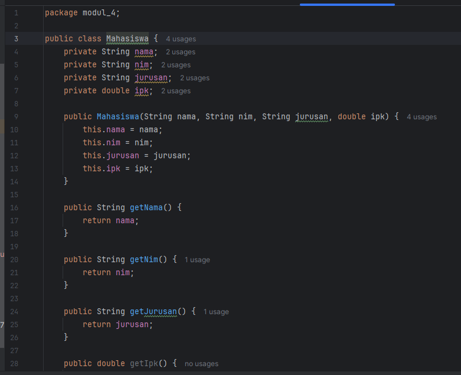

#### 2.2 Langkah Praktikum
1. Menentukan package program.

2. Membuat class MataKuliah sebagai template objek.

3. Mendeklarasikan atribut kode, nama, sks, dan nilai secara private.

4. Menginisialisasi atribut melalui constructor saat objek dibuat.

5. Menyediakan getter untuk membaca data dan setter untuk mengubah nilai.

6. Digunakan oleh class lain (misalnya KartuRencanaStudi) dalam sistem KRS untuk merepresentasikan data setiap mata kuliah.

#### Screenshoot Hasil
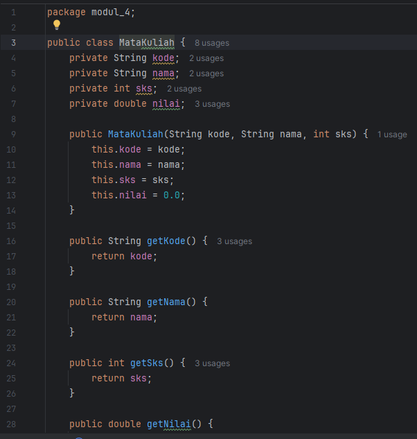

#### 2.3 Langkah Praktikum
1. Menentukan package program.

2. Membuat class KartuRencaStudi sebagai template objek.

3. Atribut yang digunakan di class ini antara lain:

    Mahasiswa mahasiswa → menyimpan data mahasiswa yang memiliki KRS.

    MataKuliah[] daftarMatakuliah → array untuk menyimpan daftar mata kuliah yang diambil.

    int jumlahMatkul → menghitung berapa banyak mata kuliah yang sudah dimasukkan.

    int maxMatkul → menentukan batas maksimal jumlah mata kuliah yang bisa diambil.

    int batasSks → menentukan batas maksimum total SKS (misalnya 24 SKS).

    Semua atribut bersifat private agar hanya bisa diakses melalui method dalam class ini (konsep encapsulation).

4. Menginisialisasi atribut melalui constructor saat objek dibuat.Constructor:

         public KartuRencanaStudi(Mahasiswa mahasiswa, int maxMatkul, int batasSks) {
         this.mahasiswa = mahasiswa;
         this.maxMatkul = maxMatkul;
         this.batasSks = batasSks;
         this.daftarMatakuliah = new MataKuliah[maxMatkul];
         this.jumlahMatkul = 0;
         }

    Berfungsi untuk menginisialisasi objek KRS baru berdasarkan data mahasiswa dan batas SKS.

    Ketika objek dibuat, array daftarMatakuliah disiapkan dengan ukuran tertentu, dan jumlahMatkul diatur ke 0.

5. Menghitung total SKS yang diambil mahasiswa.

6. Menambahkan mata kuliah dengan validasi batas SKS dan kapasitas maksimum.

7. Menghapus mata kuliah berdasarkan kode.

8. Menginput nilai ke setiap mata kuliah.

9. Menampilkan seluruh isi KRS beserta total SKS.

10. Menentukan mata kuliah dengan nilai terbaik dan terburuk.

#### Screenshoot Hasil
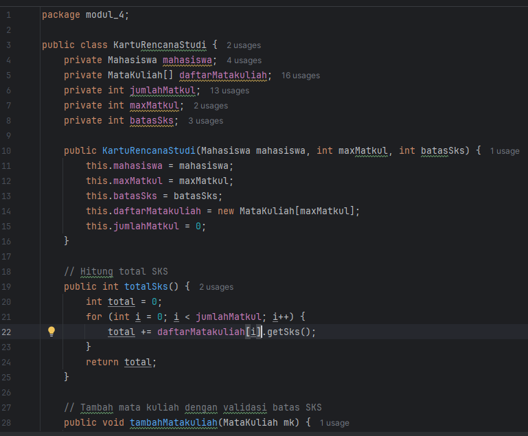
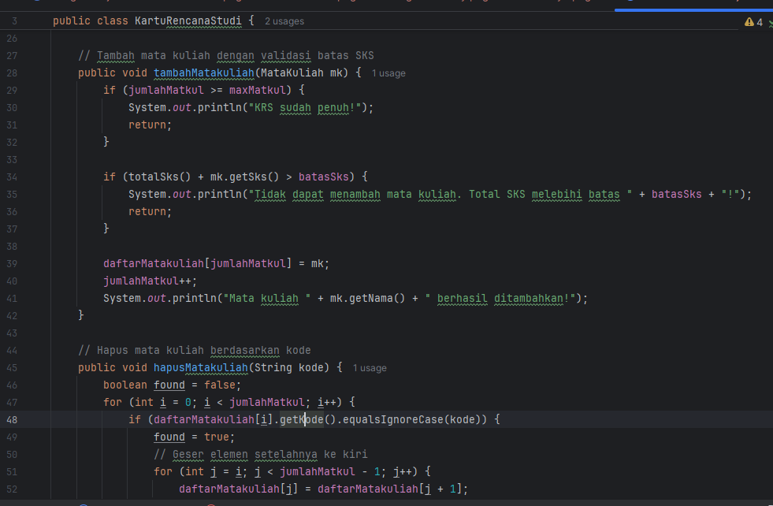
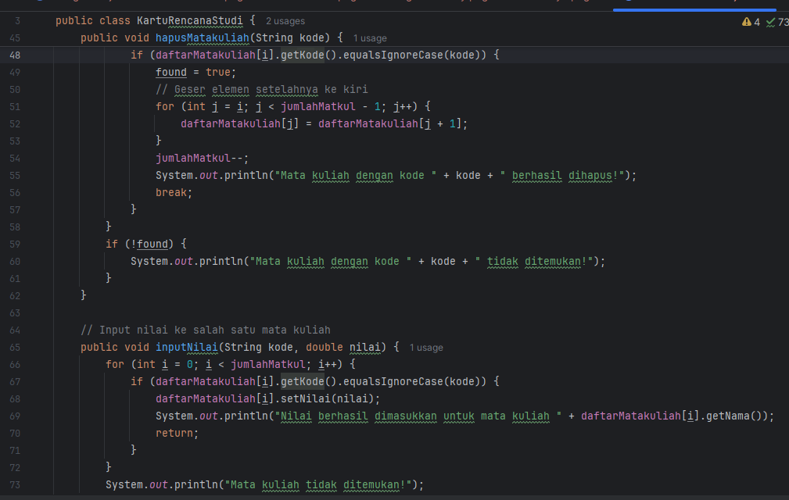
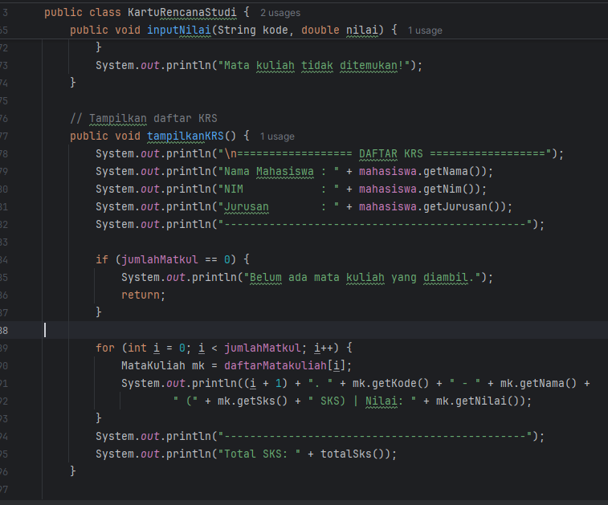
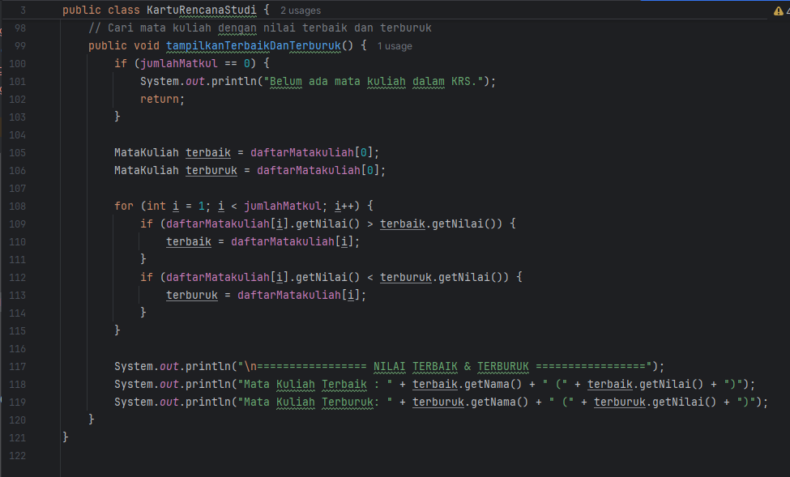

#### 2.4 Langkah Praktikum Main
1. Inisialisasi Program
Program dimulai dengan menampilkan judul “Sistem Kartu Rencana Studi (KRS)” dan menggunakan Scanner untuk menerima input dari pengguna.

2. Input Data Mahasiswa
Pengguna memasukkan nama, NIM, dan jurusan.
Data tersebut digunakan untuk membuat objek:

         Mahasiswa mhs = new Mahasiswa(nama, nim, jurusan, 0.0);

IPK diisi dengan nilai awal 0.0.

3. Membuat Objek KRS
Objek KartuRencanaStudi dibuat dengan batas maksimal 10 mata kuliah dan 24 SKS:

        KartuRencanaStudi krs = new KartuRencanaStudi(mhs, 10, 24);

4. Menampilkan Menu Utama
Program menampilkan menu berulang (dalam while) agar pengguna bisa memilih:

Tambah mata kuliah

Input nilai

Hapus mata kuliah

Tampilkan KRS

Tampilkan nilai terbaik & terburuk

Keluar

6. Proses Tiap Menu

Tambah Mata Kuliah:
Pengguna memasukkan kode, nama, dan jumlah SKS.
Objek MataKuliah dibuat dan ditambahkan ke KRS jika total SKS tidak melebihi 24.

Input Nilai:
Pengguna memasukkan kode mata kuliah dan nilai, lalu sistem memperbarui nilainya.

Hapus Mata Kuliah:
Pengguna mengetik kode MK yang ingin dihapus dari daftar.

Tampilkan KRS:
Program menampilkan data mahasiswa, daftar mata kuliah, nilai, dan total SKS.

Nilai Terbaik & Terburuk:
Sistem mencari mata kuliah dengan nilai tertinggi dan terendah lalu menampilkannya.

Keluar:
Program berhenti setelah menampilkan pesan “Keluar dari program...”.

7. Penutupan Program
Setelah keluar, objek Scanner ditutup dengan input.close() untuk mengakhiri proses input.

#### Screenshoot Hasil
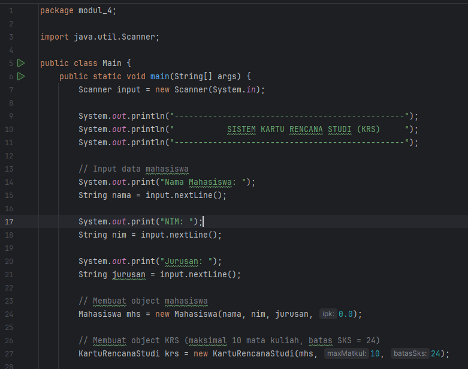
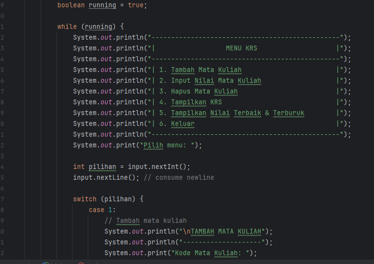
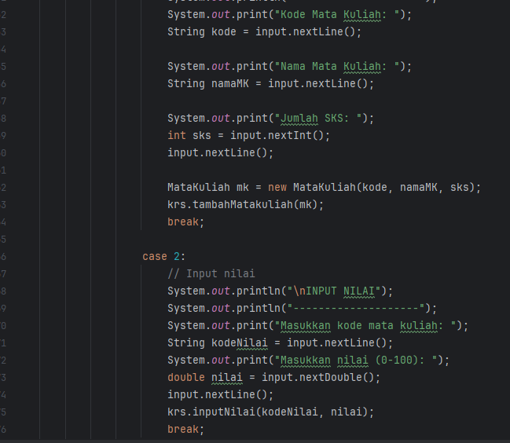
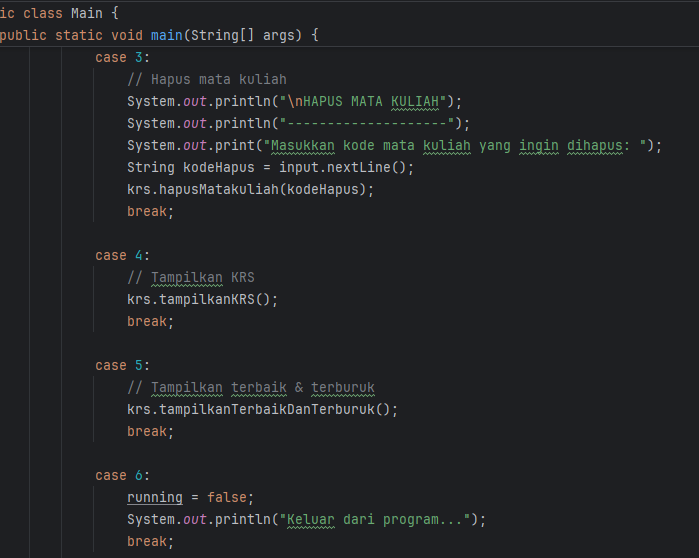
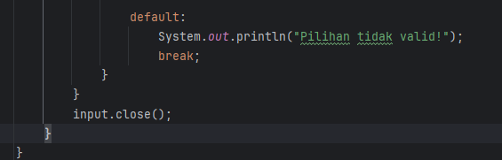
## 5. Referensi
Dicoding – Apa itu OOP pada Java? Beserta Contohnya
https://www.dicoding.com/blog/apa-itu-oop-pada-java-beserta-contohnya/

Jagoan Hosting – Pengertian OOP (Object Oriented Programming) dan 4 Prinsipnya
https://www.jagoanhosting.com/blog/oop-adalah/

Petani Kode – Pengenalan Pemrograman Berorientasi Objek di Python
https://www.petanikode.com/python-oop-pengenalan/

