# Laporan Modul 5: Enkapsulasi
**Mata Kuliah:** Praktikum Pemrograman Berorientasi Objek   
**Nama:** MUHAMMAD RAYYAN ALFARISY
**NIM:** 2024573010118
**Kelas:** TI 2A

---

## 1. Abstrak
Modul ini membahas tentang enkapsulasi (encapsulation) dalam pemrograman berorientasi objek menggunakan bahasa Java. Enkapsulasi merupakan konsep penting yang bertujuan untuk menyembunyikan detail implementasi dari pengguna kelas, serta melindungi data agar tidak diakses secara langsung dari luar kelas.
Melalui tiga praktikum, mahasiswa mempelajari perbedaan access modifier (public, private, protected, default), penggunaan getter dan setter, serta penerapan read-only dan write-only property. Dengan pemahaman ini, mahasiswa diharapkan mampu merancang kelas yang aman, modular, dan mudah dikelola.

### Praktikum 1 
#### Dasar Teori
Access modifier digunakan untuk mengatur tingkat akses terhadap variabel dan metode dalam suatu kelas. Ada empat jenis utama:

Public → Dapat diakses dari mana saja.

Private → Hanya dapat diakses di dalam kelas itu sendiri.

Protected → Dapat diakses oleh subclass atau kelas dalam paket yang sama.

Default (tanpa modifier) → Dapat diakses hanya di dalam paket yang sama.

Dengan menggunakan access modifier, developer dapat menjaga keamanan data dan mencegah penyalahgunaan atribut atau metode.

#### 1.1 Langkah Praktikum
Tujuan: Mengetahui pengaruh masing-masing access modifier terhadap akses variabel dan metode.

Buka IDE (IntelliJ) dan buat proyek baru bernama modul_5.

Klik kanan pada folder src, pilih New → Package, beri nama modul_5.→ Package praktikum_1.

Klik kanan pada package tersebut → New → Java Class, beri nama Person
#### Screenshoot Hasil
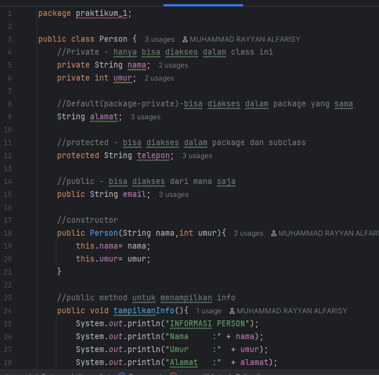
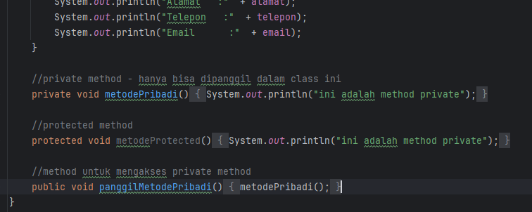

#### 1.2 Langkah Praktikum
di modul yang sama bernama modul_5.→ Package praktikum_1.

Klik kanan pada package tersebut → New → Java Class, beri nama AccessModifierTest untuk testing:

Atribut umur dan method showPrivate() tidak bisa diakses karena bersifat private.
#### Screenshoot Hasil
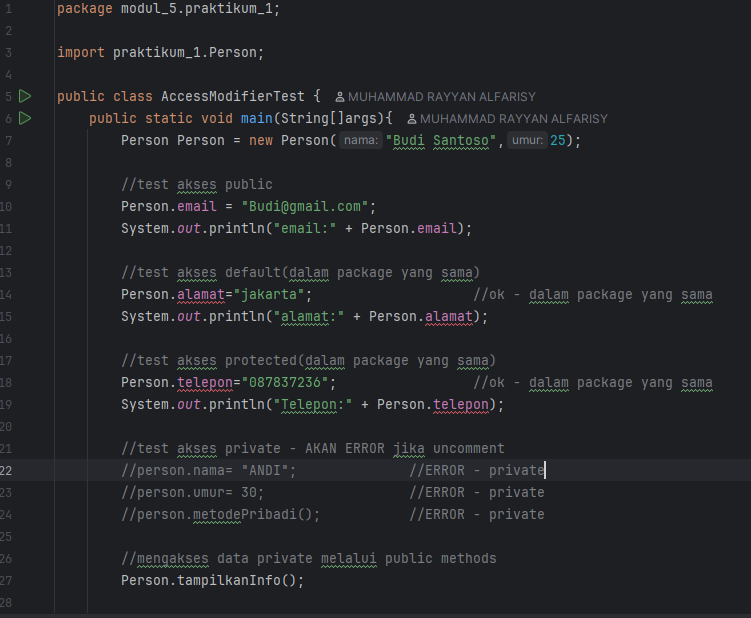
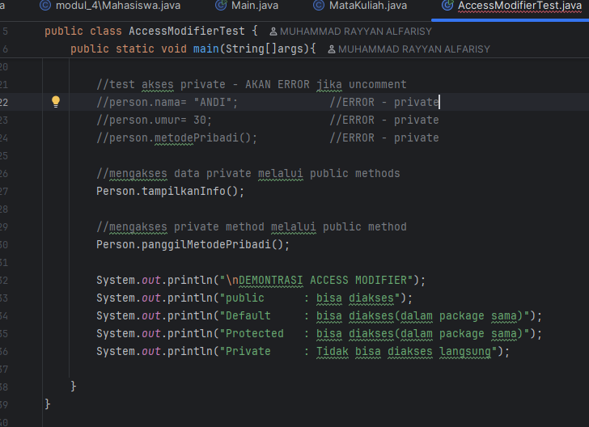

### Praktikum 2
#### Dasar Teori
1. Pengertian Getter dan Setter

Dalam pemrograman berorientasi objek (OOP), getter dan setter adalah dua jenis metode (method) yang digunakan untuk mengakses dan memodifikasi nilai dari atribut (variabel) yang dienkapsulasi di dalam suatu kelas.

Enkapsulasi bertujuan untuk menyembunyikan detail internal suatu objek agar tidak bisa diakses langsung dari luar kelas. Oleh karena itu, atribut biasanya dideklarasikan sebagai private, dan aksesnya dikontrol melalui method getter (pengambil nilai) dan setter (pengubah nilai).

Naming Convention:

Getter: get + NamaAttribute (contoh: getNama())
Setter: set + NamaAttribute (contoh: setNama())
Boolean Getter: is + NamaAttribute (contoh: isActive())
Keuntungan Menggunakan Getter/Setter:

Kontrol akses terhadap data
Validasi data sebelum disimpan
Read-only atau write-only attributes
Computed attributes
Lazy initialization
#### 2.1 Langkah Praktikum 
di modul yang sama bernama modul_5.→ Package 2.

Klik kanan pada package tersebut → New → Java Class, beri nama Mahasiswa 

#### Screenshoot Hasil
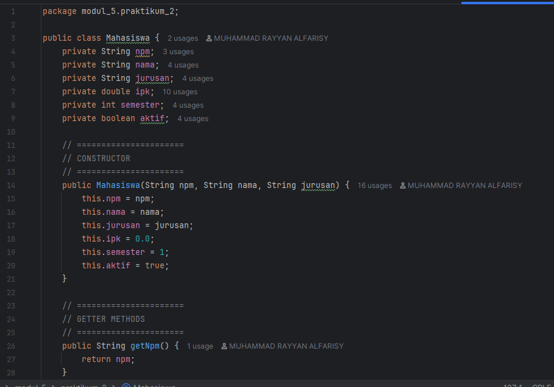
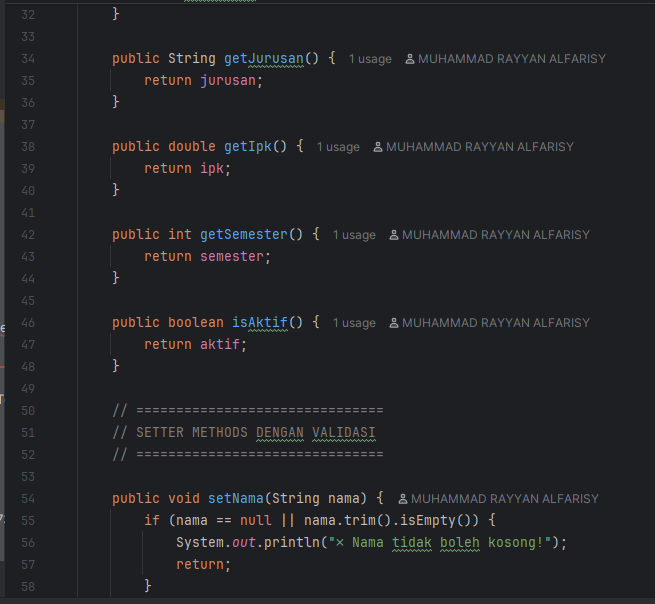
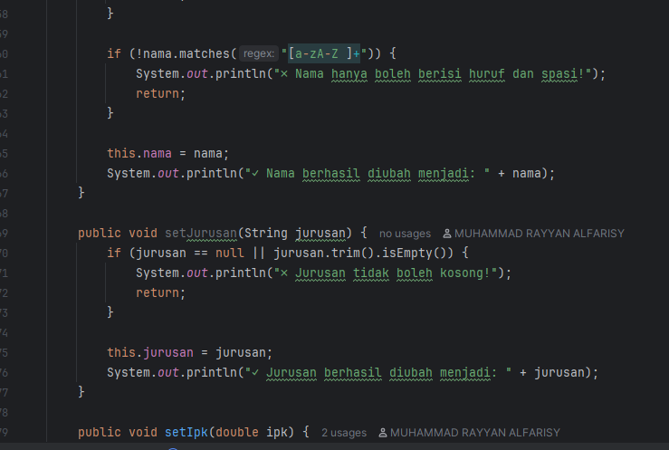
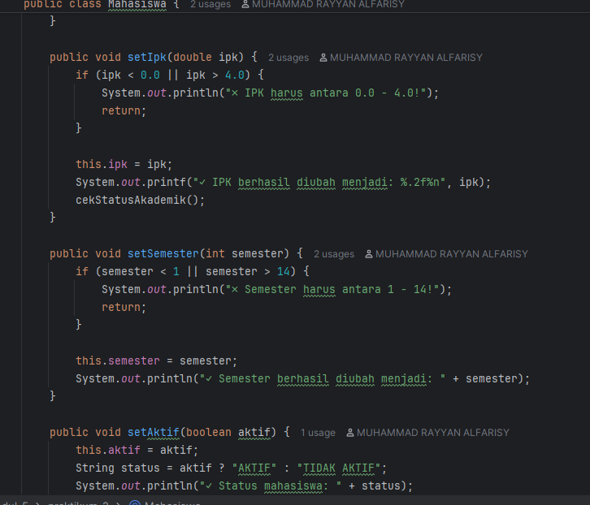
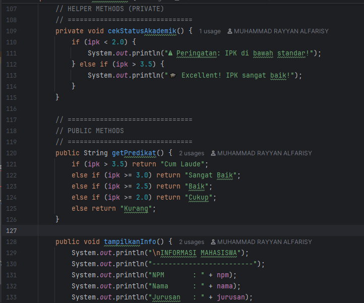
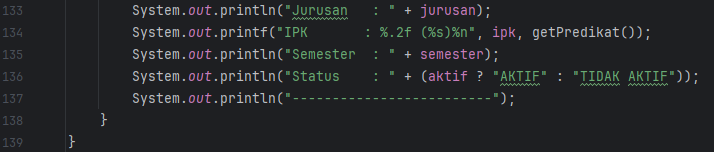
#### 2.2 Langkah Praktikum
di modul yang sama bernama modul_5.→ Package 2.

Klik kanan pada package tersebut → New → Java Class, beri nama GetterSetterTest
#### Screenshoot Hasil
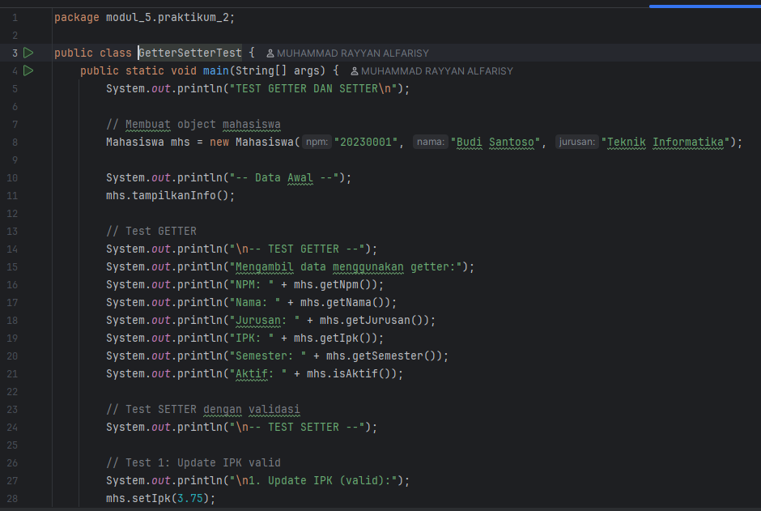
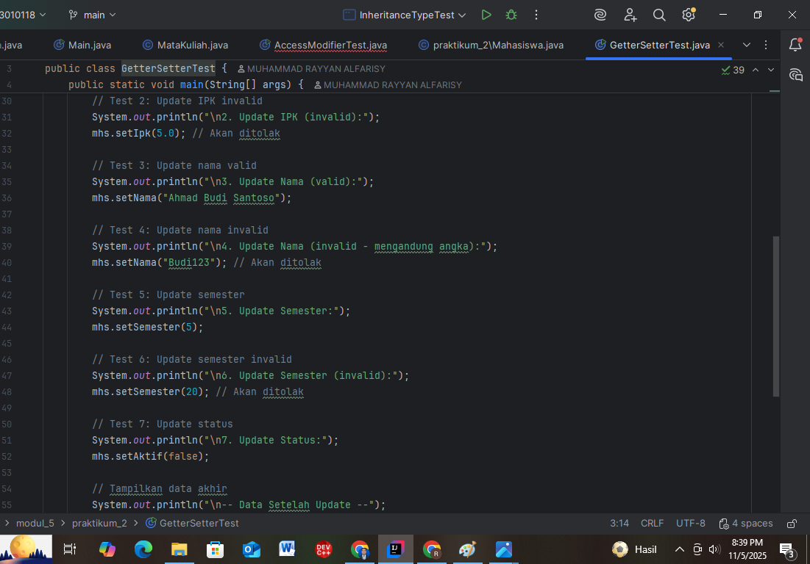
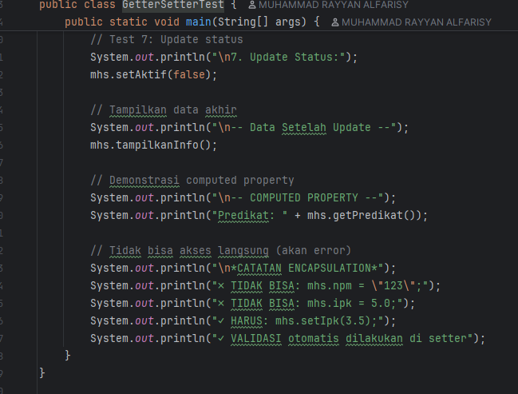

### Praktikum 3
#### Dasar Teori
Dalam pemrograman berorientasi objek, konsep enkapsulasi tidak hanya digunakan untuk menyembunyikan atribut, tetapi juga untuk mengontrol bagaimana atribut tersebut diakses dan dimodifikasi. Dua bentuk pengendalian yang umum digunakan adalah read-only property dan write-only property.

1. Read-Only Property

Read-only property adalah atribut dalam sebuah kelas yang hanya dapat dibaca (dibuka aksesnya) tetapi tidak dapat diubah secara langsung oleh kode di luar kelas.
Biasanya, atribut ini hanya memiliki getter method tanpa setter.
Getter digunakan untuk mengambil nilai atribut, sedangkan setter tidak disediakan agar nilai tidak bisa dimodifikasi.
Tujuan Read-Only Property:2. Write-Only Property

2. Write-only property 
adalah atribut yang hanya dapat diisi atau dimodifikasi, tetapi tidak dapat dibaca secara langsung dari luar kelas.
Atribut ini memiliki setter method, tetapi tidak memiliki getter.
Tujuan Write-Only Property:

Melindungi data rahasia agar tidak bisa ditampilkan (misalnya PIN, password, token).

Menjaga privasi dan keamanan aplikasi.

Mencegah pembacaan atribut sensitif oleh objek atau modul lain.

#### 3.1 Langkah Praktikum
Buat sebuah package baru di dalam package modul_5 dengan nama praktikum_3

Buat class Product dengan berbagai jenis properties
#### Screenshoot Hasil
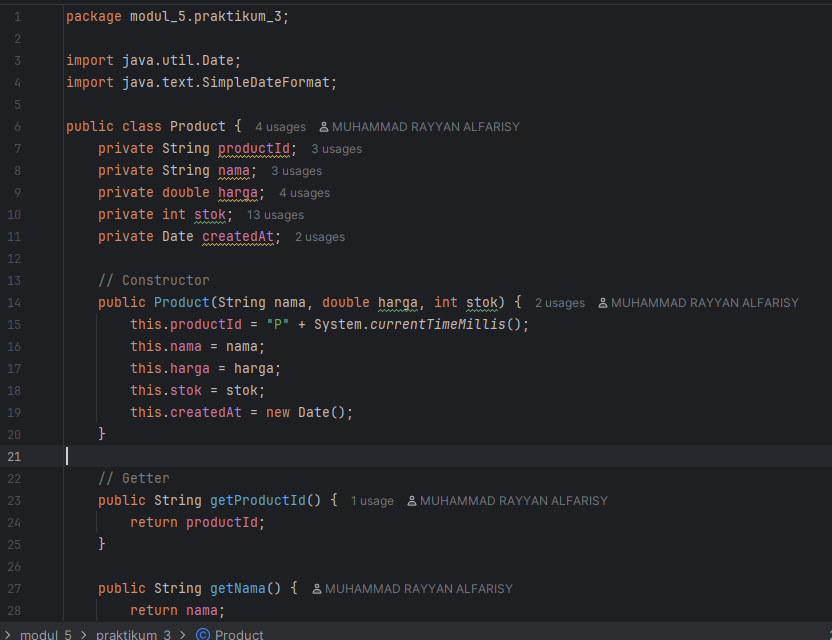
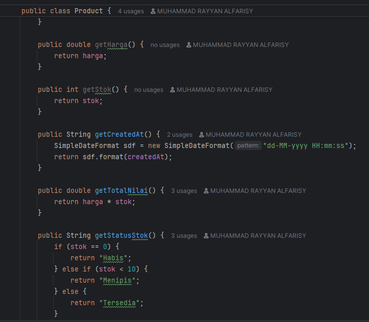
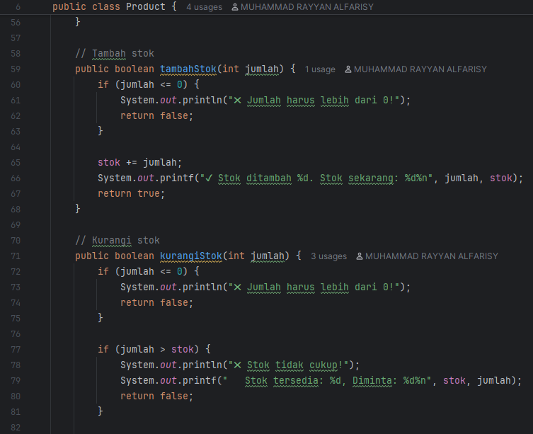

#### 3.2 Langkah Praktikum
Buat sebuah package baru di dalam package modul_5 dengan nama praktikum_3

Buat class ProductTest dengan berbagai jenis properties
#### Screenshoot Hasil
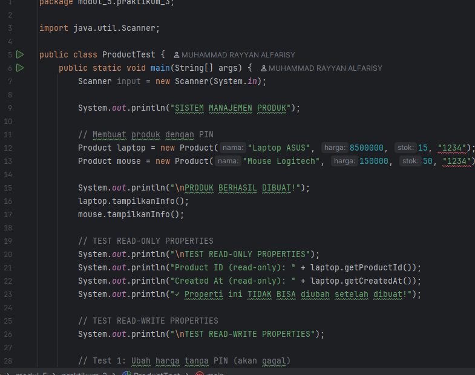
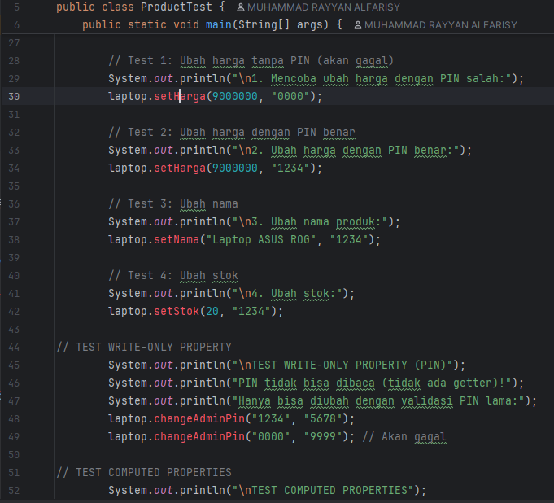
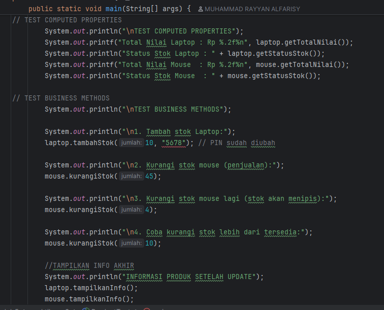
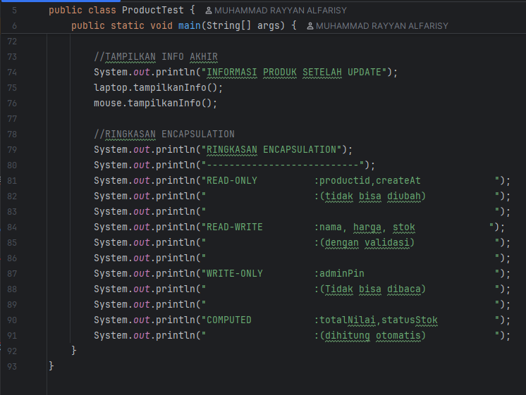
## 5. Referensi
Mohd Rzu – Modul Praktikum Pemrograman Berorientasi Objek Java: Enkapsulasi. HackMD. https://hackmd.io/@mohdrzu/B1-q0qERel

Petani Kode – “Enkapsulasi dalam Pemrograman Berorientasi Objek (OOP) Java”
https://www.petanikode.com/java-oop-enkapsulasi/

Duniailkom – “Belajar Konsep Enkapsulasi, Getter, dan Setter di Java”
https://www.duniailkom.com/tutorial-belajar-oop-java-konsep-enkapsulasi-getter-dan-setter/
