# Laporan Modul 5: Inheritance
**Mata Kuliah:** Praktikum Pemrograman Berorientasi Objek   
**Nama:** MUHAMMAD RAYYAN ALFARISY
**NIM:** 2024573010118
**Kelas:** TI 2A

---

## 1. Abstrak
Modul ini membahas konsep dasar dan penerapan Inheritance (Pewarisan) dalam pemrograman berorientasi objek. Praktikum dilakukan untuk memahami bagaimana sebuah kelas turunan (subclass) mewarisi atribut dan method dari kelas induk (superclass). Selain itu, modul memperkenalkan konsep overriding, penggunaan keyword super, multilevel inheritance, hierarchical inheritance, serta implementasinya dalam studi kasus Sistem Manajemen Perpustakaan sederhana. Praktikum ini bertujuan untuk memberikan pemahaman praktis mengenai hubungan antar kelas, bagaimana kode dapat digunakan kembali (reusability), dan bagaimana polimorfisme bekerja dalam lingkungan OOP.

### Praktikum 1 Memahami Single Inheritance
#### Dasar Teori
Single Inheritance adalah konsep pewarisan di mana satu subclass hanya memiliki satu superclass. Subclass mewarisi atribut dan method dari superclass, memungkinkan penggunaan kembali kode dan memperluas fitur. Konsep ini menggambarkan hubungan “is-a”, misalnya Student adalah Person.

Inheritance memungkinkan:

Reusability kode

Struktur program lebih terorganisir

Kemudahan dalam pengembangan fitur baru
#### 1.1 Langkah Praktikum
1. Buat package

Buat package baru bernama modul_6.praktikum_1 di dalam folder src.

2. Buat file class

Buat file Java baru dengan nama Person.java di dalam package tersebut.

3. Tulis kode class Person

Isi file dengan kode berikut:

Deklarasikan atribut name dan age

Buat constructor untuk mengisi data

Buat method displayInfo() untuk menampilkan data

Buat method greet() untuk memberi salam

4. Simpan dan pastikan tidak ada error

Cek apakah kode beres dan tidak ada tanda merah.

5. Gunakan class Person

Nanti class ini akan dipakai sebagai kelas induk (parent) untuk class lain seperti Student.
#### Screenshoot Hasil
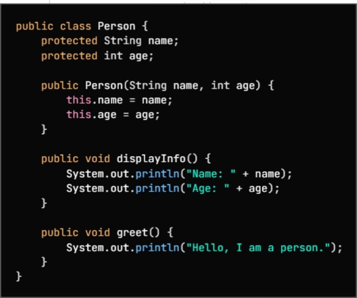
#### 1.2 Langkah Praktikum
1. Buat file class Student

Di dalam package modul_6.praktikum_1, buat file baru bernama Student.java.

2. Jadikan Student sebagai turunan Person

Gunakan extends Person agar Student mewarisi atribut dan method dari class Person.

3. Tambahkan atribut khusus Student

Buat atribut baru StudentId sebagai data tambahan yang hanya dimiliki mahasiswa.

4. Buat constructor Student

Pada constructor:

Panggil constructor Person menggunakan super(name, age)

Isi atribut StudentId dengan nilai yang diberikan.

5. Buat method study()

Tambahkan method study() untuk menampilkan aktivitas mahasiswa.

6. Override method greet()

Override method greet() dari class Person untuk menampilkan salam versi mahasiswa.

7. Simpan dan pastikan tidak ada error

Cek apakah class sudah bisa berjalan dan tidak ada kesalahan penulisan.
#### Screenshoot Hasil
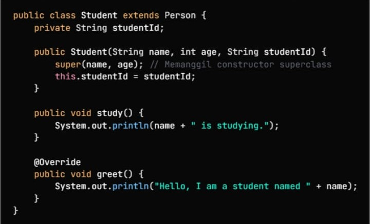
#### 1.3 Langkah Praktikum
1. Buat file baru

Buat file InheritanceTest.java di dalam package modul_6.praktikum_1.

2. Buat method main

Tambahkan method main() sebagai titik awal program dijalankan.

3. Buat objek Student pertama

Buat objek:

    Student student = new Student("alice", 20, "S12345");

Objek ini akan digunakan untuk memanggil method bawaan kelas Person dan method milik Student.

4. Panggil method dari superclass (Person)

Gunakan objek student untuk memanggil:

displayInfo() → menampilkan nama & umur

study() → aktivitas mahasiswa

greet() → versi salam milik Student

5. Buat objek Student tetapi disimpan sebagai tipe Person

         Person person = new Student("bob", 22, "S67890");

Ini untuk menunjukkan polymorphism.

6. Panggil method greet() pada objek person

Walaupun variabelnya bertipe Person, method yang dipanggil adalah versi Student karena override.

7. Jalankan program

Jalankan file untuk melihat output hasil inheritance dan polymorphism.
#### Screenshoot Hasil
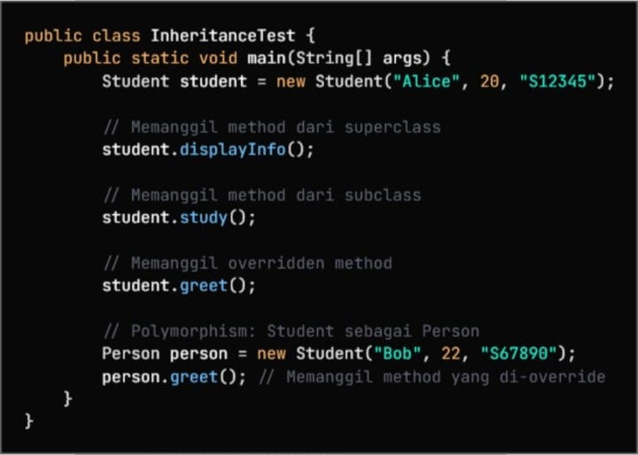
### Praktikum 2 Method Overriding dan Kata Kunci super
#### Dasar Teori
Method Overriding adalah teknik untuk mengubah implementasi method pada subclass yang sebelumnya sudah ada di superclass. Ini penting untuk polimorfisme. Aturan overriding:

1. Nama, parameter, dan tipe kembalian harus sama

2. Akses modifier tidak boleh lebih restriktif

3. Method tidak boleh final

Keyword super digunakan untuk:

1. Memanggil constructor superclass

2. Mengakses method atau atribut superclass
#### 2.1 Langkah Praktikum
1. Buat file class Vehicle

Buat file baru bernama Vehicle.java di dalam package modul_6.praktikum_2.

2. Tambahkan atribut dasar kendaraan

Buat dua atribut yang bisa diwarisi oleh subclass:

brand → merek kendaraan

speed → kecepatan kendaraan

Gunakan akses protected supaya subclass bisa mengaksesnya.

3. Buat constructor Vehicle

Tambahkan constructor:

menerima brand dan speed

mengisi atribut dengan nilai tersebut

4. Tambahkan method start()

Method ini menampilkan informasi bahwa kendaraan sedang dinyalakan.

5. Tambahkan method displayInfo()

Method ini digunakan untuk menampilkan:

merek kendaraan

kecepatan kendaraan

6. Simpan dan pastikan tidak ada error

Pastikan class siap digunakan sebagai superclass untuk kendaraan lain seperti Car, Bike, dll.
#### Screenshoot Hasil
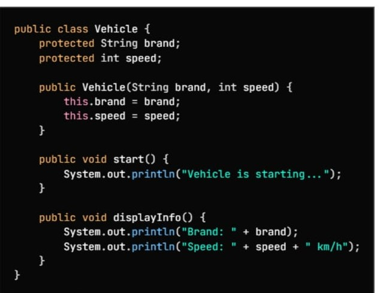
#### 2.2 Langkah Praktikum
1. Buat file Car.java

Buat file baru bernama Car.java di dalam package modul_6.praktikum_2.

2. Jadikan Car sebagai subclass

Tulis deklarasi kelas:

Car extends Vehicle

artinya Car mewarisi atribut dan method dari Vehicle.

3. Tambahkan atribut khusus Car

Buat atribut:

numberOfDoors → jumlah pintu mobil
Ini adalah atribut yang tidak dimiliki Vehicle.

4. Buat constructor Car

Constructor menerima:

brand

speed

numberOfDoors

Lalu:

panggil constructor Vehicle dengan super(brand, speed)

isi atribut numberOfDoors

5. Override method start()

Ubah perilaku method start():

panggil super.start() untuk menjalankan versi Vehicle

tambahkan pesan tambahan milik Car

6. Override method displayInfo()

Tampilkan informasi mobil:

jalankan super.displayInfo() untuk info brand & speed

tambahkan info jumlah pintu

7. Tambahkan method khusus Car

Buat method Honk() yang menampilkan suara klakson mobil.

8. Simpan dan pastikan kode tidak error

Class Car sekarang siap digunakan dan mendukung inheritance + overriding.
#### Screenshoot Hasil
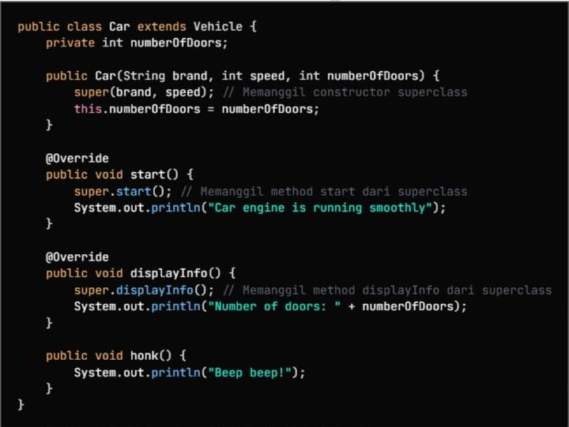
#### 2.3 Langkah Praktikum
1. Buat file OverrideTest.java

Buat file Java baru bernama OverrideTest.java di dalam package modul_6.praktikum_2.

2. Buat method main()

Tambahkan method main() sebagai tempat menjalankan program.

3. Buat objek Car pertama

Buat objek:

    Car car = new Car("Toyota", 180, 4);

Objek ini akan digunakan untuk menguji:

method override

method milik Car

method milik Vehicle yang diwarisi

4. Panggil method dari object Car

Jalankan:

car.start() → menguji override start()

car.displayInfo() → menguji override displayInfo()

car.Honk() → method khusus Car

5. Buat objek Car tetapi direferensikan sebagai Vehicle

       Vehicle vehicle = new Car("Honda", 200, 2);

Langkah ini untuk menunjukkan polymorphism:

objeknya tetap Car

tapi variabelnya bertipe Vehicle

6. Panggil method dari variabel Vehicle

Jalankan:

vehicle.start()

vehicle.displayInfo()

Karena overriding, yang dipanggil tetap versi Car, bukan Vehicle.

7. Simpan dan jalankan program

Jalankan program untuk melihat:

perbedaan method override

cara polymorphism bekerja

output dari method Car dan Vehicle
#### Screenshoot Hasil
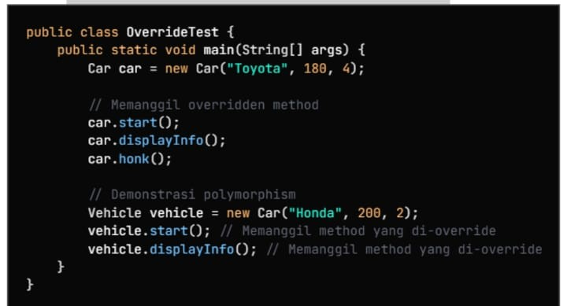
### Praktikum 3 Multilevel dan Hierarchical Inheritance
#### Dasar Teori
1. Multilevel Inheritance

Multilevel Inheritance adalah pewarisan yang terjadi secara bertingkat dari satu kelas ke kelas berikutnya.
Jadi sebuah kelas mewarisi dari kelas lain, lalu kelas tersebut bisa diwarisi lagi oleh kelas berikutnya.
Strukturnya mirip rantai pewarisan.

Contohnya:

        Animal  →  Mammal  →  Dog

Penjelasannya:

Kelas Animal adalah induk pertama.

Kelas Mammal mewarisi semua sifat dasar Animal.

Kelas Dog mewarisi sifat dari Mammal, sekaligus secara tidak langsung mewarisi sifat Animal.

Intinya:
Setiap kelas di bawah akan otomatis membawa semua kemampuan kelas di atasnya. Semakin panjang rantai pewarisan, semakin banyak fitur yang diturunkan.

2. Hierarchical Inheritance

Hierarchical Inheritance adalah pewarisan di mana satu superclass memiliki lebih dari satu subclass.
Jadi ada satu kelas induk, lalu banyak kelas turunan yang mengambil sifat yang sama darinya.

Contohnya:

        Mammal
        /    \
     Cat    Human

Penjelasannya:

Kelas Mammal adalah superclass.

Kelas Cat mewarisi sifat Mammal.

Kelas Human juga mewarisi sifat Mammal.

Meskipun kedua subclass berbeda, keduanya memiliki dasar perilaku yang sama dari kelas induknya.

Intinya:
Satu kelas induk dipakai bersama oleh banyak kelas turunan, sehingga kode yang sama tidak perlu ditulis berulang kali.
#### 3.1 Langkah Praktikum
1. Buat file Animal.java

Buat file baru bernama Animal.java di dalam package modul_6.praktikum_3.

2. Buat deklarasi kelas Animal

Tulis kelas Animal sebagai kelas induk (superclass) untuk hewan-hewan lain yang akan mewarisi perilakunya.

3. Tambahkan atribut name

Buat atribut:

protected String name
Kenapa protected?
Supaya subclass (misalnya Dog, Cat, dan lain-lain) bisa mengakses nama hewan.

4. Buat constructor Animal

Constructor menerima parameter:

name

Lalu mengisi atribut this.name.

5. Tambahkan method eat()

Method ini menampilkan:

[name] is eating.

Sebagai perilaku dasar hewan.

6. Tambahkan method sleep()

Method ini menampilkan:

[name] is sleeping.

7. Simpan class

Pastikan class siap digunakan sebagai parent class untuk praktikum multilevel atau hierarchical inheritance.
#### Screenshoot Hasil
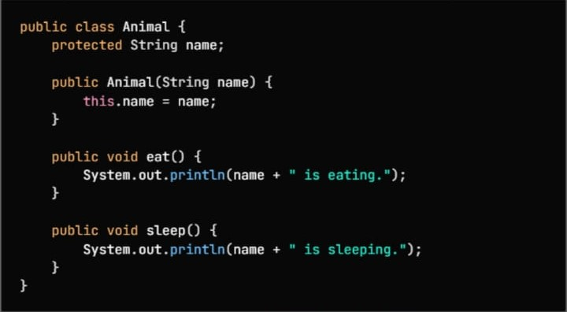
#### 3.2 Langkah Praktikum
1. Buat file Mammal.java

Buat file baru bernama Mammal.java di dalam package modul_6.praktikum_3.

2. Jadikan Mammal sebagai subclass

Tulis deklarasi:

    public class Mammal extends Animal

Ini artinya Mammal mewarisi atribut dan method dari kelas Animal.

3. Tambahkan atribut baru

Buat atribut khusus mamalia:

furColor → warna bulu
Gunakan akses protected supaya subclass lain (misalnya Dog) bisa menggunakannya.

4. Buat constructor Mammal

Constructor menerima:

name (nama hewan)

furColor (warna bulu)

Di dalam constructor:

panggil constructor superclass Animal dengan super(name)

isi nilai furColor

5. Tambahkan method giveBirth()

Metode ini mencetak:

[name] is giving birth to live young

Menjelaskan bahwa mamalia melahirkan anak hidup (ciri khas mamalia).

6. Simpan class

Sekarang kelas Mammal sudah siap menjadi middle class untuk inheritance bertingkat (multilevel), misalnya Dog → Mammal → Animal.
#### Screenshoot Hasil
#### 3.3 Langkah Praktikum
1. Buat class Dog di dalam package modul_6.praktikum_3.

2. Jadikan Dog sebagai subclass dari Mammal dengan menggunakan keyword extends.

3. Tambahkan atribut baru breed untuk menyimpan ras anjing.

4. Buat constructor Dog yang menerima tiga parameter: name, furColor, dan breed.

5. Panggil constructor superclass (Mammal) menggunakan super(name, furColor).

6. Simpan nilai breed ke atribut lokal.

7. Tambahkan method bark() untuk menampilkan suara anjing.

8. Override method eat() dari superclass agar perilakunya berbeda khusus untuk anjing.
#### Screenshoot Hasil
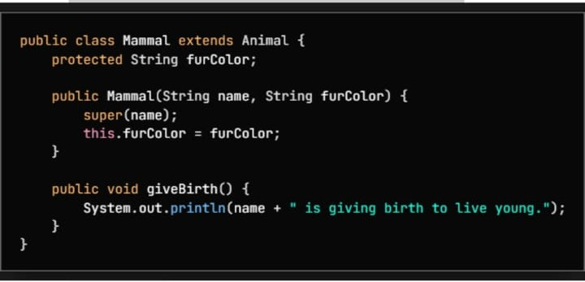
#### 3.4 Langkah Praktikum
1. Buat file Cat.java

Buat file baru bernama Cat.java di dalam package modul_6.praktikum_3.

2. Deklarasikan kelas Cat sebagai subclass

Gunakan keyword:

    extends Mammal

Ini membuat Cat mewarisi atribut dan method dari Mammal → yang sebelumnya mewarisi dari Animal.

3. Tambahkan atribut khusus

Buat atribut baru:

isIndoor → untuk menandai apakah kucing peliharaan dalam rumah atau tidak.

4. Buat constructor Cat

Constructor menerima:

name

furColor

isIndoor

Lalu:

Panggil constructor superclass Mammal dengan:

super(name, furColor);

Isi nilai atribut isIndoor.

5. Tambahkan method meow()

Buat method untuk menampilkan suara kucing:

    [name] is meowing: meow meow!

6. Override method eat()

Ubah perilaku method eat() khusus untuk kucing, sehingga outputnya menunjukkan makanan kucing.

7. Simpan class

Sekarang class Cat siap digunakan dalam demonstrasi hierarchical inheritance bersama Dog, Mammal, dan Animal.
#### Screenshoot Hasil
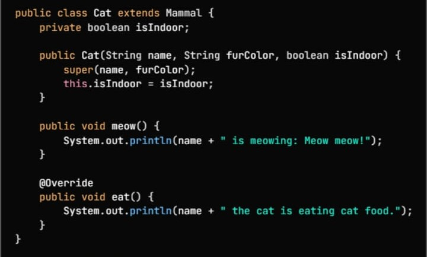
#### 3.5 Langkah Praktikum
1. Buat file InheritanceTypeTest.java

Buat file baru bernama InheritanceTypeTest.java di dalam package modul_6.praktikum_3.

2. Buat method main()

Tambahkan method main sebagai tempat menjalankan semua pengujian inheritance.

3. Buat objek Dog

Buat objek:

    Dog dog = new Dog("Buddy", "Brown", "Golden Retriever");

Kemudian panggil method:

dog.eat() → override dari Dog

dog.sleep() → diwarisi dari Animal

dog.giveBirth() → diwarisi dari Mammal

dog.bark() → method khusus Dog

4. Buat objek Cat

Buat objek:

    Cat cat = new Cat("Whiskers", "White", true);

Kemudian jalankan:

cat.eat() → override dari Cat

cat.sleep() → dari Animal

cat.giveBirth() → dari Mammal

cat.meow() → method khusus Cat

5. Buat array Animal untuk menunjukkan polymorphism

Buat array:

    Animal[] animals = {
    new Dog("Max", "Black", "Labrador"),
    new Cat("Luna", "Gray", false)
    };

Ini menunjukkan hierarchical inheritance + polymorphism, karena objek Dog dan Cat diperlakukan sebagai Animal.

6. Loop dan panggil method eat()

Gunakan for-each untuk memanggil:

animal.eat();

Karena overriding, yang dipanggil adalah versi eat() milik subclass (Dog atau Cat).

7. Jalankan program

Perhatikan output untuk melihat:

perbedaan method override

pewarisan method dari superclass

polymorphism dalam array Animal

#### Screenshoot Hasil
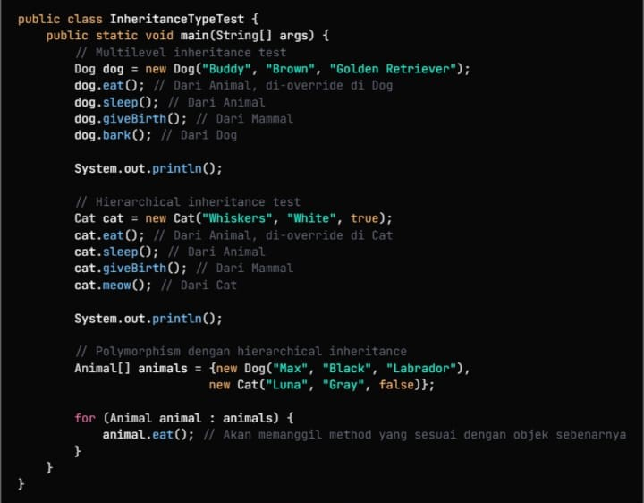
### Praktikum 4  Sistem Manajemen Perpustakaan Sederhana
#### Dasar Teori
Sistem Perpustakaan memanfaatkan inheritance untuk mengelompokkan item-item perpustakaan.
Superclass: LibraryItem
Subclass:

Book

Magazine

DVD

Manfaat inheritance dalam sistem ini:

Struktur kode rapi

Reusability pada atribut umum (judul, tahun terbit)

Perbedaan detail ditaruh pada subclass

Memungkinkan polymorphism untuk menampilkan berbagai jenis item dengan cara yang sama
#### 4.1 Langkah Praktikum
1. Buat file LibraryItem.java

Buat file Java baru dengan nama LibraryItem.java di dalam package modul_6.praktikum_4.

2. Jadikan LibraryItem sebagai kelas abstrak

Gunakan keyword:

    public abstract class LibraryItem

Kelas abstrak berarti:

tidak bisa dibuat objek langsung

hanya bisa diturunkan oleh subclass

boleh punya method abstract + non-abstract

3. Tambahkan atribut dasar

Buat empat atribut yang mewakili item perpustakaan:

itemId → kode item

title → judul

year → tahun terbit

isAvailable → status ketersediaan

Semua dibuat protected supaya bisa dipakai oleh subclass.

4. Buat constructor

Constructor menerima:

itemId

title

year

Lalu:

isi atribut

set isAvailable = true (default: bisa dipinjam)

5. Tambahkan getter untuk semua atribut

Buat method untuk mengambil nilai:

getItemId()

getTitle()

getYear()

isAvailable()

6. Tambahkan setter untuk status ketersediaan

Method:

    setAvailable(boolean available)

Untuk mengubah status item.

7. Tambahkan satu method abstrak

Buat method:

public abstract void displayInfo();

Method ini wajib di-override oleh setiap subclass seperti Book, Magazine, dan DVD.

8. Tambahkan method umum untuk semua item

Tambahkan dua method yang bisa digunakan semua subclass:

borrowItem()

Jika available → ubah jadi tidak available

Tampilkan pesan berhasil dipinjam

Jika tidak available → tampilkan pesan tidak tersedia

returnItem()

Ubah menjadi available kembali

Tampilkan pesan berhasil dikembalikan

9. Simpan class

LibraryItem siap menjadi superclass untuk semua jenis item perpustakaan dalam praktikum.

#### Screenshoot Hasil
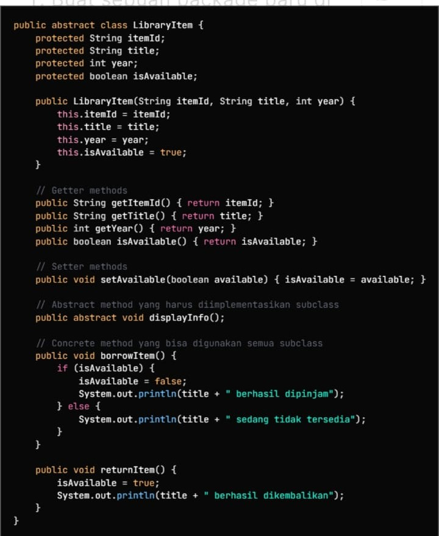
#### 4.2 Langkah Praktikum
1. Buat file Book.java

Buat file baru bernama Book.java di dalam package modul_6.praktikum_4.

2. Jadikan Book sebagai subclass dari LibraryItem

Gunakan keyword:

    extends LibraryItem

Ini berarti Book mewarisi atribut dan method dasar dari LibraryItem.

3. Tambahkan atribut khusus untuk buku

Buat tiga atribut tambahan:

author → nama penulis

isbn → kode ISBN buku

numberOfPages → jumlah halaman

Atribut ini hanya dimiliki oleh buku.

4. Buat constructor Book

Constructor menerima:

itemId

title

year

author

isbn

numberOfPages

Lalu:

panggil constructor superclass menggunakan super(itemId, title, year)

isi nilai atribut lainnya ke variabel lokal

5. Override method displayInfo()

Buat implementasi method displayInfo() yang menampilkan informasi lengkap buku, seperti:

ID

Judul

Penulis

Tahun

ISBN

Jumlah halaman

Status ketersediaan

Method ini wajib di-override karena berasal dari kelas abstrak LibraryItem.

6. Tambahkan method khusus Book

Buat method:

    public void readSample()

Method ini menampilkan pesan bahwa pengguna membaca contoh isi buku.

7. Simpan class

Kelas Book sudah siap digunakan dalam sistem perpustakaan bersama subclass lainnya.
#### Screenshoot Hasil
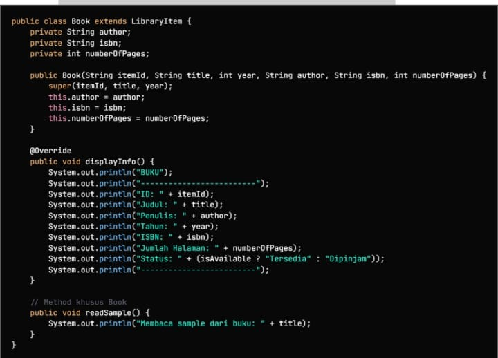
#### 4.3 Langkah Praktikum
1. Buat file Magazine.java

Buat file baru bernama Magazine.java di dalam package modul_6.praktikum_4.

2. Jadikan Magazine sebagai subclass dari LibraryItem

Gunakan:

    extends LibraryItem

Agar Magazine mewarisi atribut & method dasar dari LibraryItem.

3. Tambahkan atribut khusus untuk majalah

Tambahkan tiga atribut:

publisher → nama penerbit

issueNumber → nomor edisi

category → jenis/kategori majalah

Atribut ini hanya dimiliki oleh majalah.

4. Buat constructor Magazine

Constructor menerima:

itemId

title

year

publisher

issueNumber

category

Lalu:

Panggil constructor superclass:

super(itemId, title, year);

Isi atribut khusus majalah dengan nilai yang diberikan.

5. Override method displayInfo()

Implementasi baru digunakan untuk menampilkan info majalah:

ID

Judul

Penerbit

Tahun

Edisi

Kategori

Status ("Tersedia" atau "Dipinjam")

Method ini meng-override method abstrak dari LibraryItem.

6. Tambahkan method khusus Magazine

Buat method:

    browseArticles()

Method ini menampilkan pesan bahwa pengguna sedang melihat artikel dalam majalah.

7. Simpan class

Class Magazine sudah siap digunakan untuk uji coba peminjaman dan pengembalian item perpustakaan.
#### Screenshoot Hasil
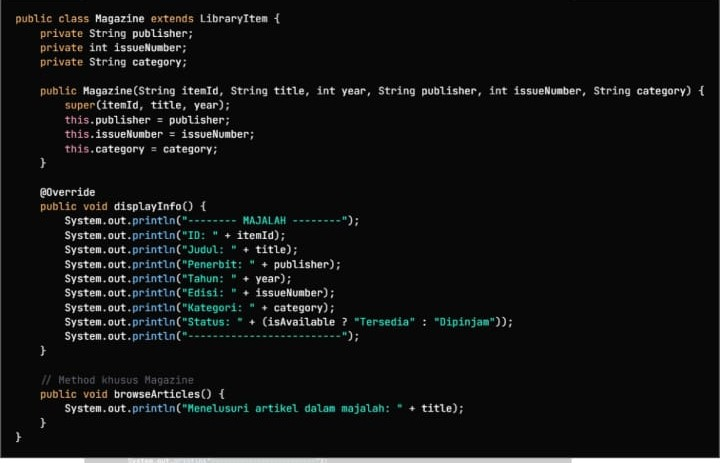
#### 4.4 Langkah Praktikum
1. Membuat Class DVD dalam Package modul_6.praktikum_4

Buat sebuah file baru bernama DVD.java di dalam package modul_6.praktikum_4.

Ini memastikan struktur projek tetap konsisten dan mudah dikelola.

2. Mendeklarasikan Kelas DVD sebagai Subclass dari LibraryItem

Gunakan keyword extends agar kelas DVD mewarisi atribut dan metode dari LibraryItem.

    public class DVD extends LibraryItem {

Dengan ini, DVD otomatis memiliki itemId, title, year, isAvailable, serta method bawaan seperti borrowItem() dan returnItem().

3. Menambahkan Atribut Khusus DVD

Tambahkan atribut yang hanya dimiliki DVD:

director (String) — sutradara

duration (int) — durasi dalam menit

genre (String) — jenis film

Tujuannya agar objek DVD memiliki informasi lebih detail dibanding item perpustakaan lain.

4. Membuat Konstruktor

Konstruktor dibuat untuk menginisialisasi semua atribut termasuk memanggil konstruktor superclass:

    super(itemId, title, year);

Diikuti pengisian atribut khusus:

    this.director = director;
    this.duration = duration;
    this.genre = genre;

Ini memastikan setiap objek DVD memiliki data lengkap saat dibuat.

5. Meng-Override Method displayInfo()

Method ini dibuat ulang (override) untuk menampilkan informasi DVD dengan format:

Menampilkan identitas dasar (ID, Judul, Tahun)

Menampilkan atribut khusus (Sutradara, Durasi, Genre)

Menampilkan status ketersediaan (Tersedia / Dipinjam)

Override penting agar tampilan info sesuai kebutuhan jenis item.

6. Menambahkan Method Khusus DVD

Buat method tambahan bernama playTrailer() yang menjadi perilaku unik kelas DVD.

Fungsinya menampilkan pesan seolah memutar trailer:

    System.out.println("Memutar trailer DVD: " + title);

Ini menunjukkan konsep polimorfisme plus fitur tambahan pada subclass.

7. Menggunakan Objek DVD dalam Program Utama (opsional untuk demo)

Dalam main, kamu bisa membuat objek demo:

    DVD dvd = new DVD("D001", "Interstellar", 2014, "Christopher Nolan", 169, "Sci-Fi");
    dvd.displayInfo();
    dvd.playTrailer();

Ini memastikan seluruh method berjalan sesuai harapan.
#### Screenshoot Hasil
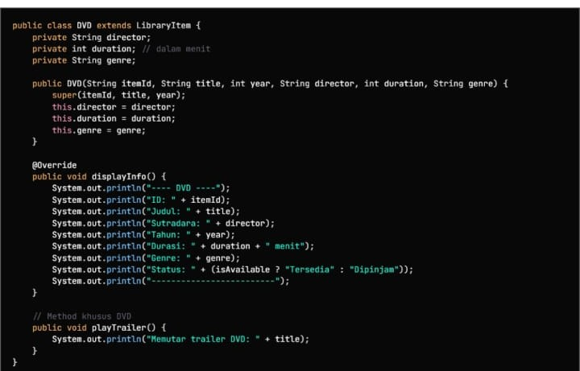
#### 4.5 Langkah Praktikum
1. Membuat Package

Buat package baru bernama:

modul_6.praktikum_4

Tujuannya supaya semua file program berada dalam satu folder yang rapi.

2. Membuat Class Induk: LibraryItem

Buat class LibraryItem sebagai dasar semua item perpustakaan.
Isi class ini dengan:

Atribut umum: itemId, title, year, isAvailable

Method:

displayInfo() (abstract)

borrowItem()

returnItem()

getter untuk semua atribut

Class ini akan menjadi parent dari Book, Magazine, dan DVD.

3. Membuat Class Turunan

Buat 3 class yang extends LibraryItem:

a. Book

Tambahkan atribut:

author

isbn

numberOfPages

Override displayInfo()
Tambahkan method khusus readSample().

b. Magazine

Tambahkan atribut:

publisher

issueNumber

category

Override displayInfo()
Tambahkan method browseArticles().

c. DVD

Tambahkan atribut:

director

duration

genre

Override displayInfo()
Tambahkan method playTrailer().

Tujuan: melatih konsep inheritance dan polymorphism.

4. Membuat Class Utama: LibraryManagementSystem

Class ini berfungsi sebagai program utama.

Isi dengan:

ArrayList<LibraryItem> untuk menyimpan daftar item

Scanner untuk input user

Menu pilihan yang akan dijalankan oleh user

Method yang perlu dibuat:

4.1 initializeSampleData()

Menambahkan contoh data awal:

2 buku

1 majalah

1 DVD

4.2 displayMenu()

Menampilkan menu utama:

Tampilkan semua item

Pinjam item

Kembalikan item

Tambah item

Cari item

Keluar

4.3 displayAllItems()

Menampilkan semua item dengan memanggil displayInfo().

4.4 borrowItem()

Input ID → meminjam item.

4.5 returnItem()

Input ID → mengembalikan item.

4.6 addNewItem()

Menambahkan item baru berdasarkan jenis (Buku, Majalah, DVD).

4.7 searchItem()

Mencari item berdasarkan judul (kata kunci).

5. Menjalankan Program

Pada method main():

Panggil initializeSampleData()

Tampilkan menu berulang-ulang menggunakan while(true)

Jalankan pilihan sesuai input pengguna

Program berhenti saat user memilih “Keluar”.

6. Pengujian

Uji fitur-fitur:

Menampilkan semua item

Meminjam item

Mengembalikan item

Menambah item baru

Mencari item

Pastikan semua berjalan sesuai logika.

7. Kesimpulan

Dari praktikum ini mahasiswa belajar:

Dasar OOP: inheritance, polymorphism, dan abstraction

Penggunaan ArrayList untuk menyimpan objek

Cara membuat menu interaktif dengan Scanner

Cara mengelola data dalam program perpustakaan sederhana
#### Screenshoot Hasil
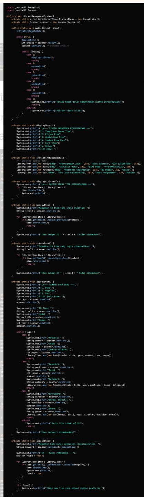
## 5. Referensi
Tutorial Java OOP – Petani Kode (https://www.petanikode.com/java-oop/
)

Programmer Indonesia – Dasar Pewarisan Java

Kelas Terbuka – Playlist OOP Java di YouTube

Modul Praktikum PBO – Inheritance (HackMD)
