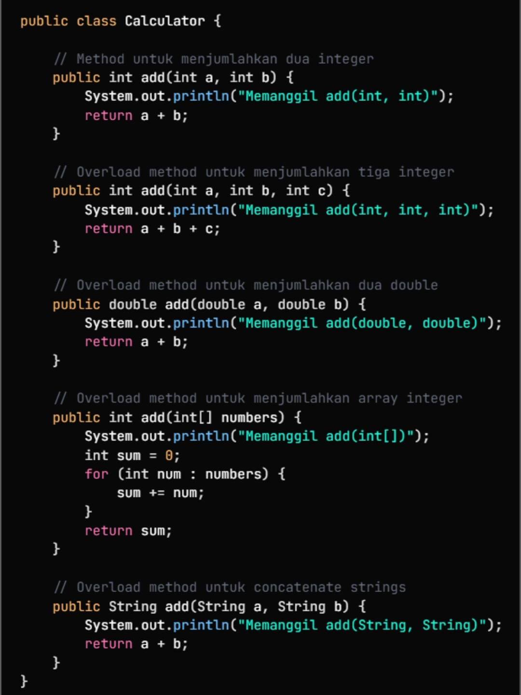
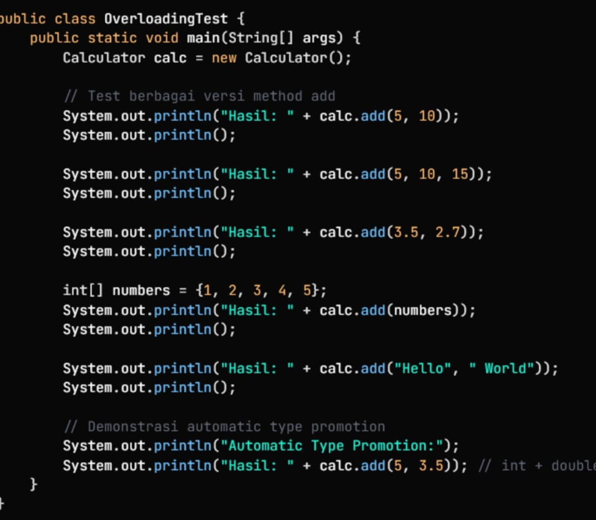
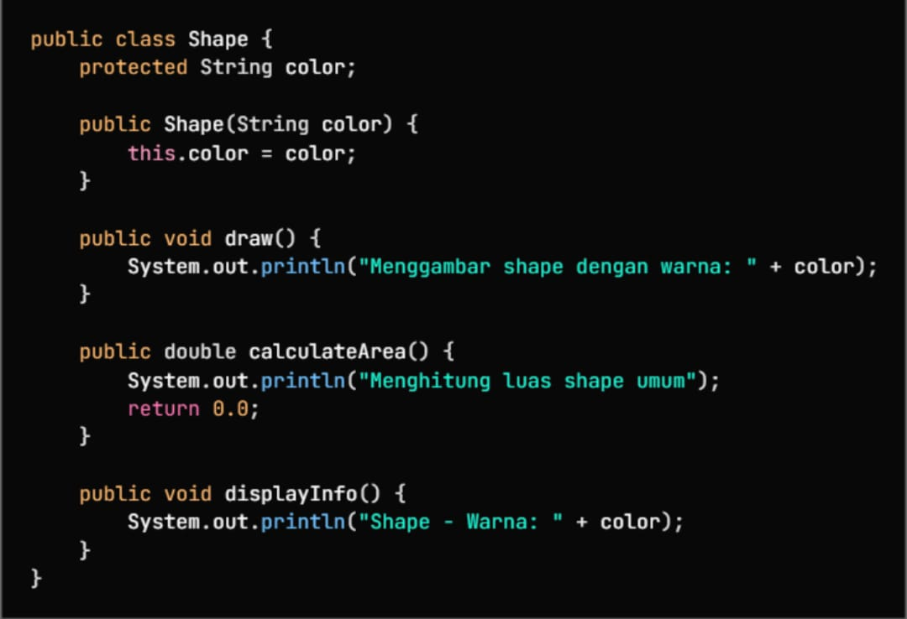
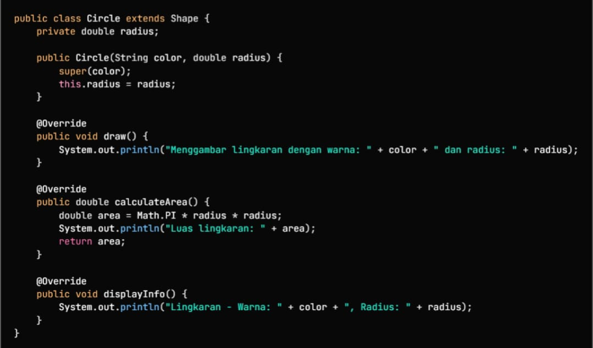
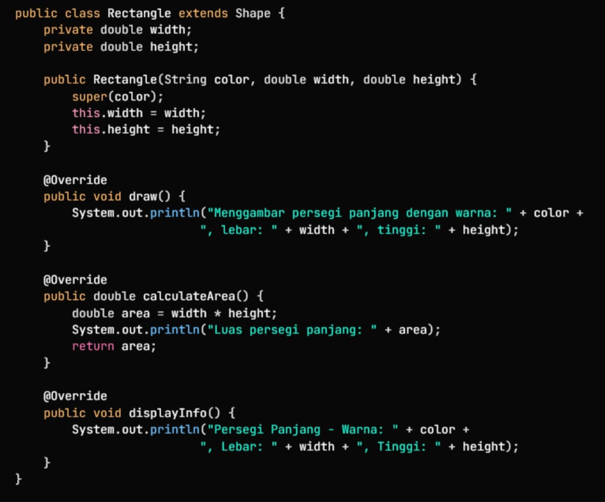
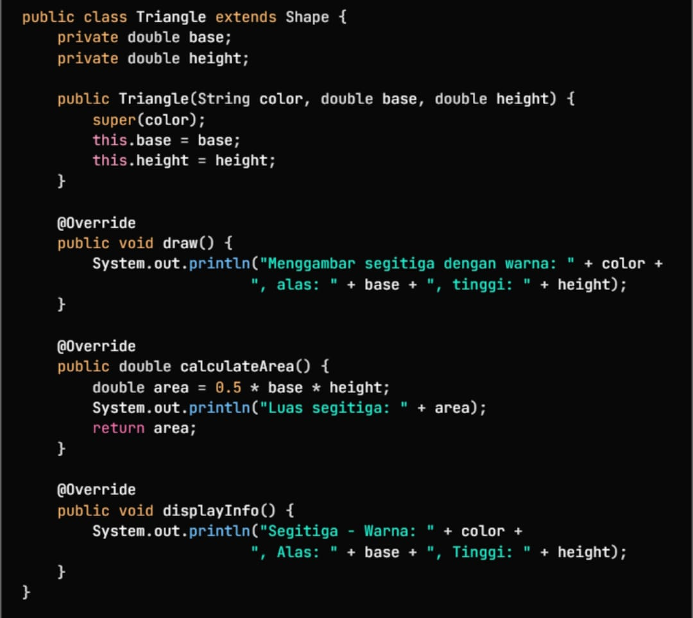
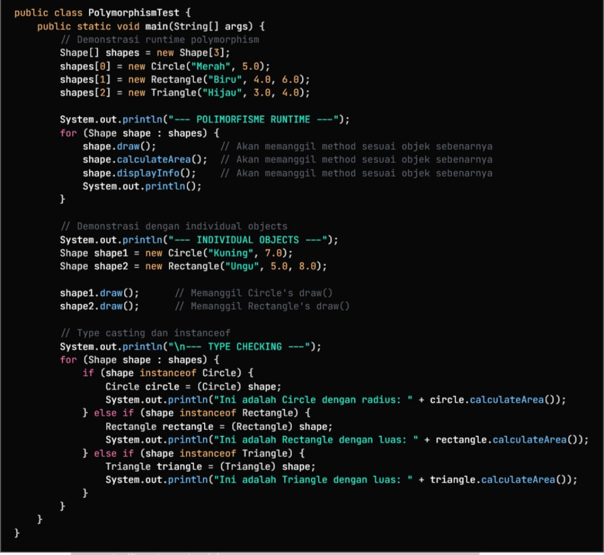

# Laporan Modul 5: Polymorphism
**Mata Kuliah:** Praktikum Pemrograman Berorientasi Objek   
**Nama:** MUHAMMAD RAYYAN ALFARISY
**NIM:** 2024573010118
**Kelas:** TI 2A

---

## 1. Abstrak
### 1.Pengertian
Dalam konteks OOP, polimorfisme berasal dari bahasa Yunani: poly (banyak) + morphism (bentuk). Artinya: objek yang bisa mengambil banyak bentuk.
Secara pemrograman: kemampuan variabel, fungsi atau objek untuk memiliki beberapa bentuk atau tipe perilaku.
Materi menjelaskan: “polymorphism adalah sebuah konsep … di mana sebuah interface tunggal digunakan pada entitas yang berbeda-beda”.

### 2.Kenapa Polimorfisme Penting?
Beberapa manfaat yang disebutkan:

Fleksibilitas: Kode menjadi lebih mudah diperluas.
Reuse (Pemakaian ulang kode): Dengan menggunakan interface atau method yang sama untuk banyak jenis objek.
Kemudahan pemeliharaan (maintainability): Karena struktur lebih konsisten dan terorganisir.
Dynamic Behaviour: Perilaku objek ditentukan saat runtime (bukan hanya saat kompilasi).
Interface Consistency: Penggunaan interface yang konsisten meskipun objek di belakangnya berbeda.

### 3. Cara Implementasi
Materi menyebut metode-metode berikut untuk menerapkan polimorfisme:

Gunakan inheritance hierarchy: kelas induk (superclass) dan kelas turunannya (subclass).

Lakukan method overriding di subclass untuk mengubah atau memperluas perilaku method dari superclass.

Gunakan reference dari superclass untuk memegang objek subclass (misalnya Shape s = new Circle();).

Panggilan method yang tepat akan ditentukan pada runtime berdasarkan tipe aktual objek.

### 4. Jenis‐jenis Polimorfisme
Materi membagi polimorfisme ke dalam dua kategori terbesar:

a) Compile‐time Polymorphism (Method Overloading)

Terjadi saat kompilasi (compile time).

Ditunjukkan dengan overload method: metode yang sama nama-nya, tetapi mempunyai parameter yang berbeda dalam suatu kelas.

Materi menempatkan method overloading di bagian compile-time polymorphism.

b) Runtime Polymorphism (Method Overriding)

Terjadi saat runtime.

Metode di subclass menggantikan atau memperluas metode di superclass dengan nama & parameter yang sama.

Materi menyebut: “method overriding terjadi ketika subclass … menyediakan implementasi spesifik …”

Aturan penting:

Nama dan parameter sama dengan method di superclass.

Tipe return harus sama atau subtype dari return type superclass.

Access modifier di subclass tidak boleh lebih restriktif dari di superclass.

Method yang dideklarasikan final di superclass tidak bisa di-override.

### Praktikum 1 Memahami Method Overloading (Compile-time Polymorphism)
#### Dasar Teori
Method overloading adalah bentuk polimorfisme kompilasi. Dalam satu kelas, beberapa method dapat memiliki nama yang sama tetapi parameter berbeda. Compiler akan memilih method yang tepat berdasarkan argumen yang diterima.
#### 1.1 Langkah Praktikum
1. Buat package dan class

Buat package: modul_7.praktikum_1

Buat file: Calculator.java

2. Tambahkan method add dasar

Method untuk menjumlahkan 2 angka integer.

3. Tambahkan beberapa method overloading

add(int a, int b, int c) → menjumlahkan 3 integer

add(double a, double b) → menjumlahkan 2 double

add(int[] numbers) → menjumlahkan elemen array

add(String a, String b) → menggabungkan string

4. Buat class untuk uji coba (main)

Buat objek Calculator.

Panggil semua versi method add.

5. Jalankan program

Lihat output untuk memastikan setiap method overloading dipanggil sesuai jenis parameter.

#### Screenshoot Hasil

#### 1.2 Langkah Praktikum

1. Buat Package Baru

Buat package:

modul_7.praktikum_1

2. Buat Class Calculator

Isi class ini dengan beberapa method add() yang parameternya berbeda-beda, misalnya:

add(int, int)

add(int, int, int)

add(double, double)

add(int[] array)

add(String, String)

Tujuan: untuk mendemonstrasikan method overloading.

3. Buat Class OverloadingTest

Tambahkan method main untuk menjalankan pengujian semua method add().

4. Buat Object Calculator

        Calculator calc = new Calculator();

5. Uji Semua Versi Method add()

Panggil method-method berikut:

calc.add(5, 10);

calc.add(5, 10, 15);

calc.add(3.5, 2.7);

calc.add(numbers);

calc.add("hello","world");

Tujuan: melihat bagaimana Java memilih method berdasarkan parameter.

6. Uji Automatic Type Promotion

Panggil:

        calc.add(5, 3.5);

Java akan otomatis mempromosikan int → double.

7. Jalankan Program

Lihat output yang menunjukkan perbedaan hasil dari setiap versi method.

8. Catat Hasilnya untuk Laporan

Tuliskan:

Output setiap pemanggilan method

Penjelasan singkat bahwa Java memilih method berdasarkan tipe dan jumlah parameter

Catatan tentang “automatic type promotion”

### Praktikum 2 Memahami Method Overriding (Runtime Polymorphism)
#### Dasar Teori
Method overriding adalah proses ketika subclass membuat ulang method dari superclass dengan implementasi baru. Overriding memungkinkan polymorphism runtime, karena method yang dipanggil bergantung pada objek sebenarnya, bukan tipe referensinya.

super digunakan untuk:

Memanggil method milik superclass

Memanggil konstruktor superclass

Mengakses atribut superclass

#### Screenshoot Hasil

#### 2.1 Langkah Praktikum
Buat sebuah package baru di dalam package modul_7 dengan nama praktikum_2

Buat class Shape sebagai superclass

Tambahkan atribut:

protected String color;

Buat constructor untuk mengisi warna:

public Shape(String color)

Buat method draw() untuk menampilkan teks menggambar shape.

Buat method calculateArea() yang mengembalikan 0.0.

Buat method displayInfo() untuk menampilkan warna dari shape.
#### Screenshoot Hasil

#### 2.2 Langkah Praktikum
Buat class Circle di package:
modul_7.praktikum_2

Jadikan Circle sebagai subclass dari Shape dengan:
extends Shape

Tambahkan atribut:

private double radius;

Buat constructor:

Panggil constructor superclass (super(color))

Isi nilai radius

Override method draw() untuk menampilkan informasi gambar lingkaran.

Override method calculateArea():

Rumus: π × radius²

Cetak luas

Return nilai luas

Override method displayInfo() untuk menampilkan warna dan radius lingkaran.
#### Screenshoot Hasil

#### 2.3 Langkah Praktikum
Buat class Rectangle di package:
modul_7.praktikum_2

Jadikan Rectangle sebagai subclass dengan:
extends Shape

Tambahkan atribut:

private double width;

private double height;

Buat constructor:

Panggil super(color)

Isi nilai width dan height

Override method draw():

Cetak informasi menggambar persegi panjang beserta warna, lebar, dan tinggi.

Override method calculateArea():

Rumus: width × height

Cetak luas

Return nilai luas

Override method displayInfo():

Tampilkan warna, lebar, dan tinggi persegi panjang.
#### Screenshoot Hasil

#### 2.4 Langkah Praktikum
Buat class Triangle.

Import dan jadikan subclass dari Shape:
extends Shape

Tambahkan atribut:

private double base;

private double height;

Buat constructor:

Panggil super(color)

Isi nilai base dan height

Override draw():

Tampilkan info menggambar segitiga (warna, alas, tinggi)

Override calculateArea():

Gunakan rumus luas segitiga: 0.5 × base × height

Cetak dan kembalikan nilai luas

Override displayInfo():

Tampilkan warna, alas, dan tinggi segitiga
#### Screenshoot Hasil

#### 2.5 Langkah Praktikum
Buat class PolymorphismTest dengan method main.

Buat array Shape[] berisi tiga objek:

Circle

Rectangle

Triangle

Lakukan loop for pada array:

Panggil draw()

Panggil calculateArea()

Panggil displayInfo()

Buat dua objek Shape tambahan (Circle dan Rectangle) untuk menunjukkan penggunaan polymorphism per objek.

Lakukan pengecekan tipe (instanceof) pada setiap objek:

Jika objek adalah Circle, cast ke Circle dan tampilkan luas

Jika objek adalah Rectangle, cast ke Rectangle dan tampilkan luas

Jika objek adalah Triangle, cast ke Triangle dan tampilkan luas
#### Screenshoot Hasil

## 3. Kesimpulan
Dari modul ini dapat disimpulkan bahwa polymorphism merupakan konsep penting dalam OOP untuk menciptakan program yang fleksibel, terstruktur, dan mudah dikembangkan. Method overloading memungkinkan satu nama method untuk digunakan dalam banyak bentuk pada compile-time, sementara method overriding memberikan kemampuan untuk memodifikasi perilaku method pada runtime. Dengan memanfaatkan inheritance dan polymorphism, programmer dapat membuat kode yang lebih efisien, rapi, dan mudah dipelihara.
## 4. Referensi
Petani Kode – Belajar Java OOP

Programmer Indonesia – Konsep Polymorphism

