# Laporan Modul 5: Abstraction
**Mata Kuliah:** Praktikum Pemrograman Berorientasi Objek   
**Nama:** MUHAMMAD RAYYAN ALFARISY
**NIM:** 2024573010118
**Kelas:** TI 2A

---

## 1. Abstrak
Abstraksi adalah konsep dalam pemrograman berorientasi objek (OOP) yang bertujuan untuk menyederhanakan kompleksitas sistem dengan menyembunyikan detail-teknis yang tidak perlu. Inti dari abstraksi: fokus pada “apa” yang dilakukan suatu objek atau komponen — bukan “bagaimana” cara kerjanya.
Contoh analogi: saat menggunakan remote TV, kita tahu tombol mana untuk menyalakan/mematikan, mengganti channel — tanpa perlu tahu mekanisme elektronik di dalamnya.
Dengan abstraksi, kita bisa:
Mendefinisikan interface atau kontrak dari suatu objek.
Menyembunyikan detail implementasi internal yang tidak penting untuk pengguna objek tersebut.
Memudahkan pengembangan, pemeliharaan, perubahan implementasi tanpa mengganggu bagian lain yang memakai objek tersebut.

### Praktikum 1 Memahami Abstract Class dan Abstract
#### Dasar Teori
Abstraksi adalah teknik dalam OOP yang bertujuan menyembunyikan detail internal suatu objek dan hanya menampilkan fungsionalitas penting kepada pengguna. Salah satu cara menerapkan abstraksi yaitu menggunakan abstract class dan abstract method.

Abstract class
Kelas yang tidak dapat di-instansiasi dan dapat berisi method abstract maupun non-abstract. Digunakan untuk membuat kerangka umum sebuah kelas.

Abstract method
Method tanpa implementasi yang wajib di-override oleh subclass.

Konsep ini mendukung pewarisan dan polimorfisme, sehingga subclass dapat memiliki karakteristik dan implementasi yang berbeda tetapi tetap mengikuti struktur dasar yang sama.
#### 1.1 Langkah Praktikum
1. Buat package bernama modul_8.praktikum_1.

2. Buat class baru bernama Shape dan jadikan sebagai abstract class.

3. Tambahkan dua atribut:

color

filled
dengan modifier protected.

4. Buat constructor untuk mengisi nilai color dan filled.

5. Buat dua abstract method:

calculateArea()

calculatePerimeter()
(method ini tidak punya isi dan wajib diimplementasikan subclass).

6. Tambahkan method konkret (getter & setter) untuk mengatur dan mengambil nilai color dan filled.

7. Tambahkan method konkret displayInfo() untuk menampilkan info dasar bentuk.

8. Simpan file, dan class Shape siap digunakan sebagai kelas induk bagi bentuk lain seperti Circle atau Rectangle.
#### Screenshoot Hasil
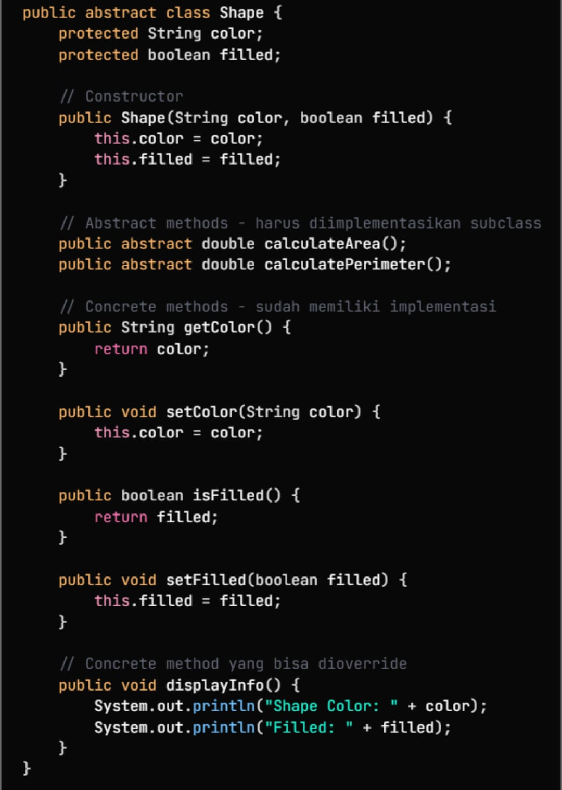
#### 1.2 Langkah Praktikum
1. Buat class Circle di dalam package modul_8.praktikum_1.

2. Jadikan Circle sebagai subclass dari Shape dengan sintaks:

         public class Circle extends Shape

3. Tambahkan atribut khusus:

radius (tipe double).

4. Buat constructor yang menerima:

color

filled

radius
dan panggil constructor super() dari class Shape.

5. Implementasikan method abstract dari Shape:

calculateArea() → menghitung luas lingkaran.

calculatePerimeter() → menghitung keliling lingkaran.

6. Override method displayInfo() untuk menampilkan:

jenis bentuk (CIRCLE)

info dari Shape (via super.displayInfo())

radius, luas, dan keliling.

7. Tambahkan method khusus:

getDiameter() → mengembalikan diameter lingkaran.

8. Simpan file dan pastikan tidak ada error.
#### Screenshoot Hasil
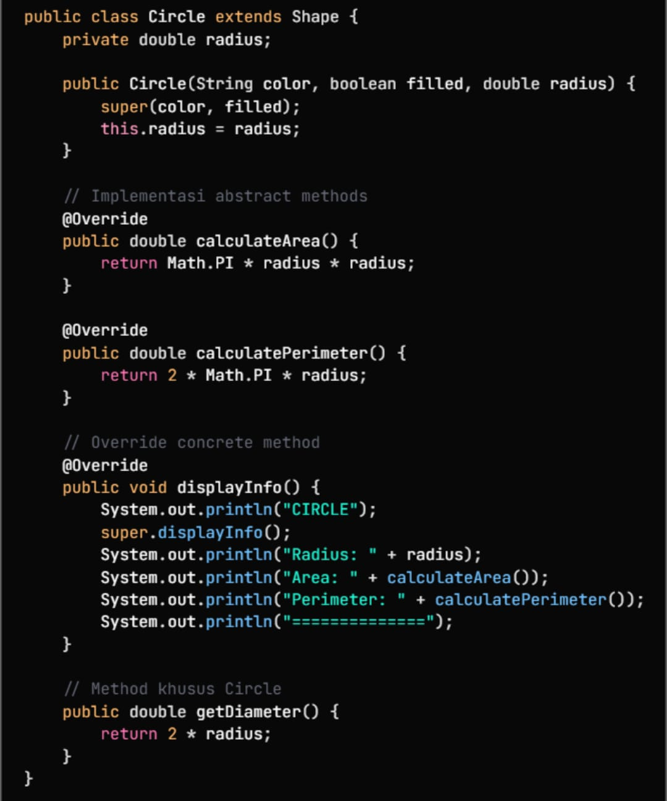
#### 1.3 Langkah Praktikum
1. Buat class Rectangle dalam package modul_8.praktikum_1.

2. Jadikan class ini subclass dari Shape:

         public class Rectangle extends Shape

3. Tambahkan dua atribut khusus:

width

height

4. Buat constructor yang menerima:

color

filled

width

height
dan panggil constructor super() untuk mengisi atribut dari Shape.

5. Implementasikan method abstract dari Shape:

calculateArea() → menghitung luas persegi panjang.

calculatePerimeter() → menghitung keliling.

6. Override method displayInfo() untuk menampilkan:

jenis bentuk (RECTANGLE)

info dari Shape

width, height, area, perimeter.

7. Tambahkan method khusus:

isSquare() → mengecek apakah width == height.

8. Simpan file dan pastikan tidak ada error.
#### Screenshoot Hasil
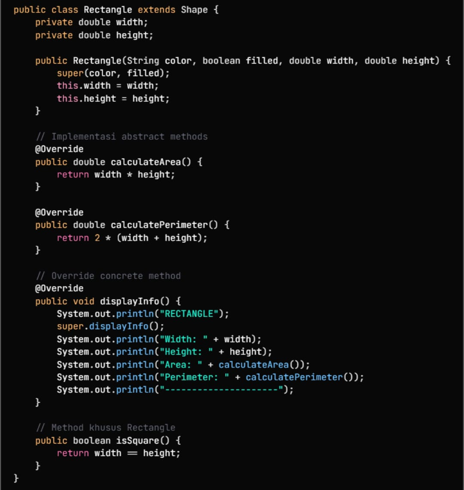
#### 1.4 Langkah Praktikum
1. Buat class AbstractClassTest dalam package modul_8.praktikum_1.

2. Di dalam method main, mulai dengan menunjukkan bahwa abstract class tidak bisa dibuat objeknya, sehingga baris:

         // Shape shape = new Shape("Red", true);

dibiarkan sebagai komentar.

3. Buat objek dari subclass konkret:

Circle circle = new Circle(...);

Rectangle rectangle = new Rectangle(...);

4. Cetak teks pembuka:
"DEMONSTRASI ABSTRACT CLASS"

5. Gunakan reference dari abstract class Shape untuk menunjuk kedua objek tersebut:

Shape shape1 = circle;

Shape shape2 = rectangle;

6. Panggil method displayInfo() secara polimorfik melalui shape1 dan shape2.

7. Gunakan method khusus subclass:

circle.getDiameter()

rectangle.isSquare()

8. Buat array Shape[] untuk menunjukkan polimorfisme dalam koleksi objek.

9. Isi array dengan objek Circle dan Rectangle dengan nilai berbeda.

10. Lakukan loop pada array, panggil:

displayInfo()

calculateArea()

sambil menjumlahkan total luas ke variabel totalArea.

11. Terakhir, tampilkan:
"Total Area of All Shapes: " + totalArea.
#### Screenshoot Hasil
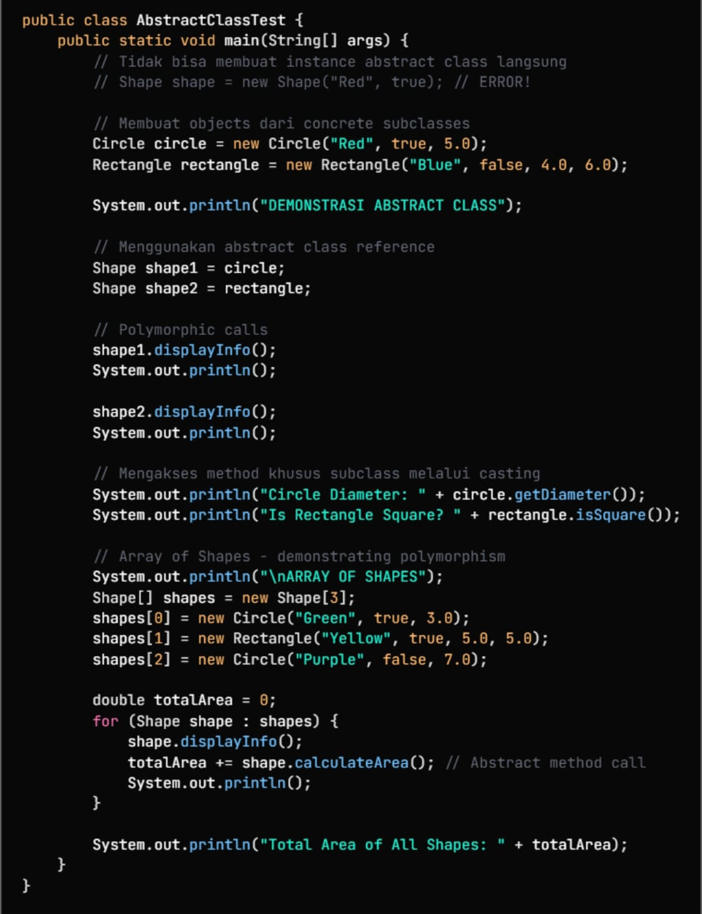
### Praktikum 2 Memahami Interface
#### Dasar Teori
Interface adalah bentuk abstraksi murni yang hanya berisi deklarasi method tanpa implementasi (kecuali default/static method). Interface digunakan untuk mendefinisikan kontrak yang wajib diikuti oleh class yang mengimplementasikannya.
Ciri-ciri interface:

Semua method bersifat public dan abstract.

Tidak bisa memiliki state kecuali public static final.

Sebuah class dapat mengimplementasi lebih dari satu interface (multiple inheritance).

#### 2.1 Langkah Praktikum
1. Buat package baru

Nama: modul_8.praktikum_2

Ini supaya file-filemu rapi dan terstruktur.

2. Buat interface Vehicle

Interface ini akan jadi blueprint untuk semua kendaraan.

Tuliskan semua metode yang harus dimiliki oleh class yang meng-implement-nya.

3. Tambahkan constant

MAX_SPEED = 200;

Constant otomatis bersifat public static final.

4. Buat method static (opsional)

Method ini bisa dipanggil tanpa membuat objek.

Contohnya:

static void displayMAXSPEED() {
System.out.println("maximum speed for all vehicle: " + MAX_SPEED + "km/h");
}

5. Buat method abstract

Ini method yang wajib di-override oleh class yang mengimplementasi Vehicle.

Misalnya start(), stop(), accelerate(double speed), brake().

6. Buat method default

Method default punya isi dan bisa dipakai langsung oleh class yang implement.

Contoh: honk() yang nge-print "beep beep!".

7. Implement interface ini di class lain

Contohnya nanti kamu bikin class Car, ElectricCar yang pakai interface ini.

#### Screenshoot Hasil
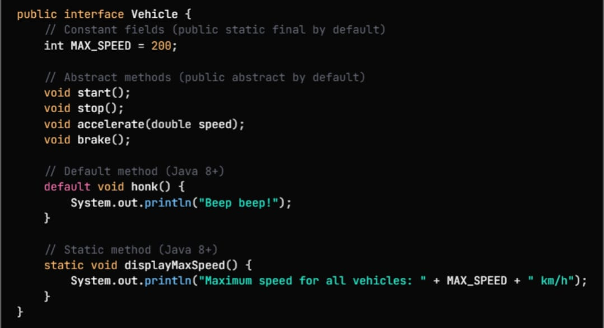
#### 2.2 Langkah Praktikum
1. Buat package

Pastikan berada di:

modul_8.praktikum_2

2. Buat interface Electric

Interface ini dipakai sebagai standar untuk kendaraan/alat yang memakai baterai.

3. Tulis method abstract yang wajib di-override

charge() → untuk mengisi daya baterai

getBatteryLevel() → mengembalikan persentase baterai

setBatteryInfo(int level) → mengatur nilai baterai

4. Tambahkan method default

Method default boleh punya isi kode.

displayBatteryInfo() untuk menampilkan status baterai secara otomatis.

5. Implement interface ini di class lain

Misalnya class ElectricCar, Ebike, Scooter, dll.

Kamu wajib mengisi implementasi semua method abstract.

6. Gunakan di main

Buat objek class yang mengimplementasikan Electric.

Panggil setBatteryInfo(), displayBatteryInfo(), charge(), dll.
#### Screenshoot Hasil
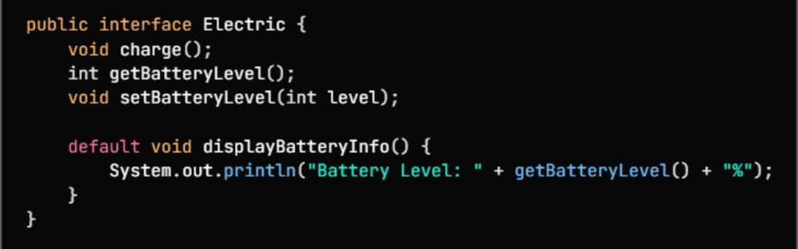
#### 2.3 Langkah Praktikum
1. Buat package

Letakkan file di:

modul_8.praktikum_2

2. Pastikan interface Vehicle sudah dibuat

Karena class Car akan implements interface tersebut.

Interface ini berisi method: start(), stop(), accelerate(), brake(), dan default honk().

3. Buat class Car yang mengimplementasikan Vehicle

Tuliskan:

public class Car implements Vehicle

4. Tambahkan atribut (properties)

brand → merek mobil

currentSpeed → kecepatan saat ini

isRunning → status mesin (nyala/mati)

5. Buat constructor

Constructor menerima nama brand.

Set nilai awal:

kecepatan = 0

mesin = mati

6. Implement semua method dari interface Vehicle

start()

Menghidupkan mobil, ubah isRunning jadi true.

stop()

Mematikan mobil dan mengembalikan kecepatan ke 0.

accelerate(double speed)

Menambah kecepatan selama mobil sedang berjalan.

Batasi kecepatan maksimal = MAX_SPEED.

brake()

Mengurangi kecepatan sebesar 10 km/h.

7. Tambahkan getter

Untuk mengambil nilai:

brand

currentSpeed

isRunning

8. Uji class di main program

Buat objek:

Car car = new Car("Toyota");

Panggil metode:

start()

accelerate(50)

brake()

stop()
#### Screenshoot Hasil
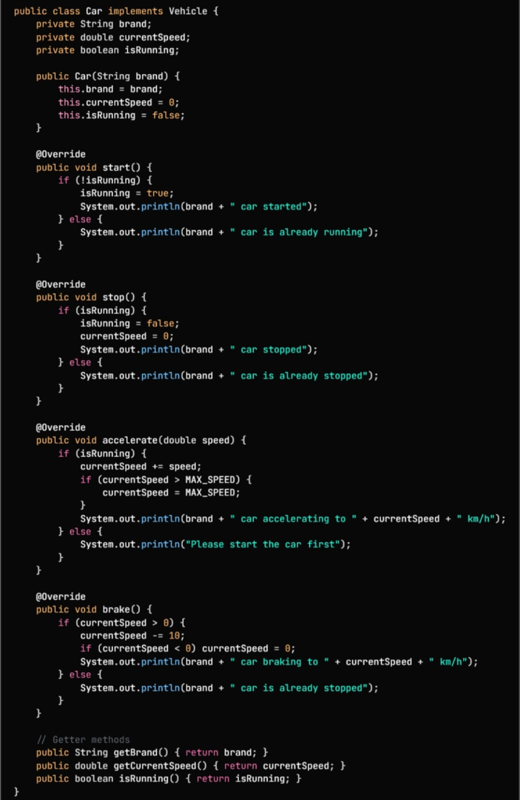
#### 2.4 Langkah Praktikum
1. Buat class ElectricCar di package:

modul_8.praktikum_2

2. Tulis deklarasi bahwa class ini memakai dua interface:

public class ElectricCar implements Vehicle, Electric

3. Buat atribut:

brand

currentSpeed

isRunning

batteryLevel

4. Buat constructor

Isi nilai awal:

speed = 0

running = false

battery = 100

5. Isi metode dari Vehicle:

start() → nyalakan mobil kalau baterai masih ada

stop() → matikan mobil

accelerate() → tambah kecepatan + kurangi baterai

brake() → kurangi kecepatan + isi baterai sedikit

honk() → ubah bunyi klakson menjadi versi mobil listrik

6. Isi metode dari Electric:

charge() → isi baterai ke 100%

getBatteryLevel() → mengembalikan level baterai

setBatteryInfo(level) → mengubah level baterai

7. Tambahkan getter biasa untuk brand, speed, dan status.

8. Gunakan di main untuk mencoba fungsi-fungsinya.
#### Screenshoot Hasil
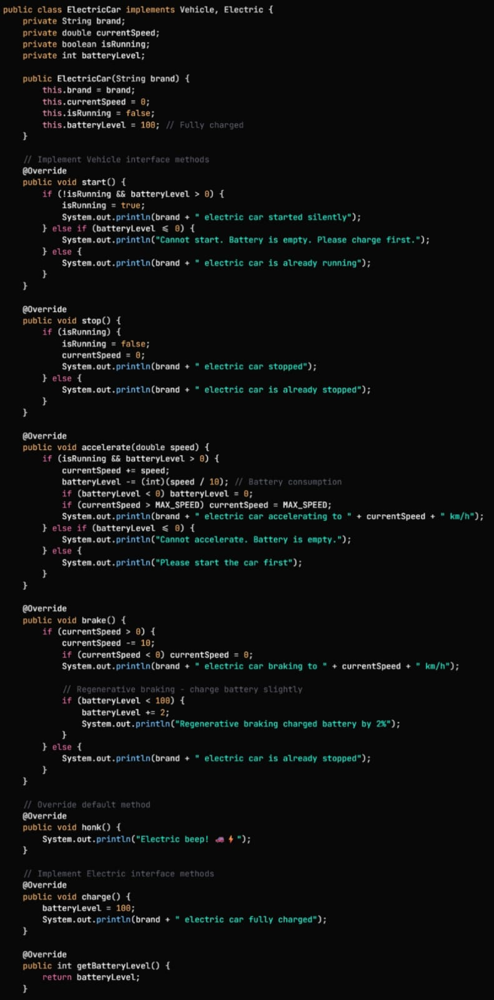
#### 2.5 Langkah Praktikum
1. Buat class ElectricCar dan pastikan implements:

        Vehicle, Electric

2. Siapkan atribut penting:

brand

currentSpeed

isRunning

batteryLevel

3. Buat constructor

Isi nama merek

Set speed = 0

Set isRunning = false

Set battery = 100

4. Implement method dari Vehicle

start() → mobil menyala jika baterai ada

stop() → mobil berhenti

accelerate() → tambah kecepatan + kurangi baterai

brake() → kurangi kecepatan + tambah baterai sedikit

honk() → bunyi klakson khusus mobil listrik

5. Implement method dari Electric

charge() → isi baterai penuh

getBatteryLevel() → kembalikan nilai baterai

setBatteryInfo() → atur nilai baterai

6. Tambahkan getter tambahan

untuk brand, speed, dan status mobil

7. Gunakan di main

Buat objek

Panggil start, accelerate, brake, displayBatteryInfo, charge, dll.
#### Screenshoot Hasil
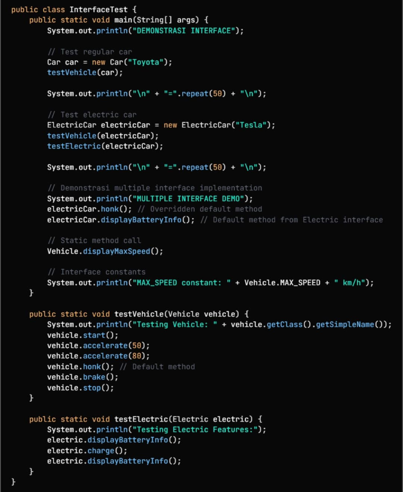
### Praktikum 3 Abstraksi dengan Access Modifiers
#### Dasar Teori
Access modifier digunakan untuk mengatur akses terhadap data atau method dalam class. Hal ini berkaitan erat dengan abstraksi karena mencegah pengguna melihat atau memanipulasi detail internal yang seharusnya tidak diketahui.
Jenis-jenis access modifier:

private → hanya bisa diakses dalam class itu sendiri

protected → bisa diakses subclass

public → dapat diakses dari mana saja

Abstraksi + access modifier menghasilkan kode yang lebih aman, terstruktur, dan mudah dipelihara.
#### 3.1 Langkah Praktikum
1. Buat class BankAccount
Letakkan dalam package:

modul_8.praktikum_3

2. Buat field privat
Ini untuk menyembunyikan data (encapsulation):

accountNumber

accountHolder

balance

password

3. Buat constructor

Isi semua data akun

Set saldo awal

Simpan password

4. Buat method public untuk akses aman

getBalance() → melihat saldo

getAccountNumber() → nomor akun

getAccountHolder() → pemilik akun

5. Buat method transaksi

deposit(amount) → menambah saldo

withdraw(amount, password) → mengambil uang harus dengan password

transfer(recipient, amount, password) → kirim uang ke akun lain

6. Buat method private untuk keamanan

authenticate(password) → cek password

logTransaction(type, amount) → mencatat transaksi

7. Buat method protected

applyInterest(rate) → menambah bunga (untuk subclass)

8. Buat method public untuk info akun

displayAccountInfo() → menampilkan data akun tanpa password
#### Screenshoot Hasil
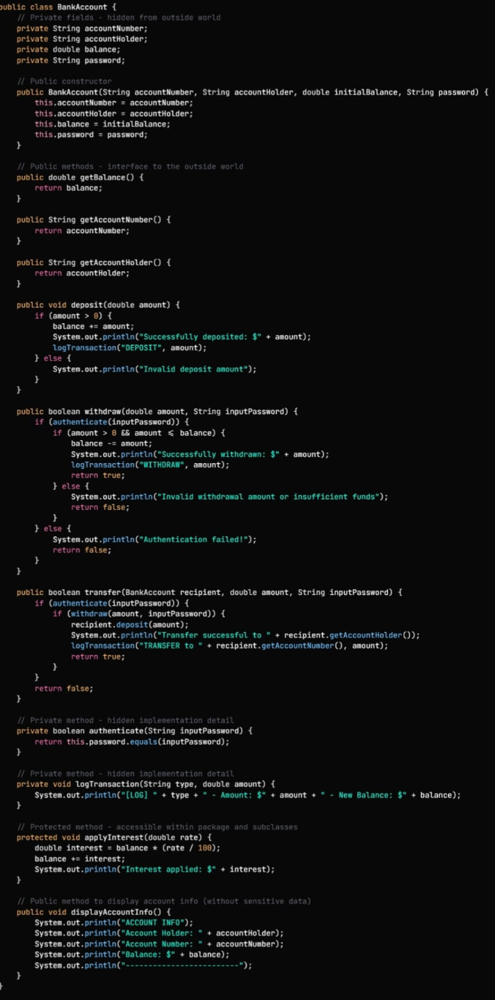
#### 3.2 Langkah Praktikum
1. Buat class SavingsAccount
Letakkan di package:

modul_8.praktikum_3

2. Gunakan inheritance
Tulis:

        extends BankAccount

Artinya, SavingsAccount mewarisi semua fitur dari BankAccount.

3. Tambah atribut baru

interestRate → bunga tahunan tabungan.

4. Buat constructor

Panggil constructor parent (super) untuk mengisi data akun.

Isi juga nilai interestRate.

5. Buat method untuk bunga bulanan

applyMonthlyInterest()

Hitung bunga bulanan dengan:

interestRate / 12

Gunakan method applyInterest() dari parent (yang protected, jadi bisa dipakai oleh subclass).

6. Override method displayAccountInfo()

Tampilkan info akun dari parent (pakai super.displayAccountInfo()).

Tambahkan informasi:

Jenis akun: Savings

Bunga tahunan
#### Screenshoot Hasil
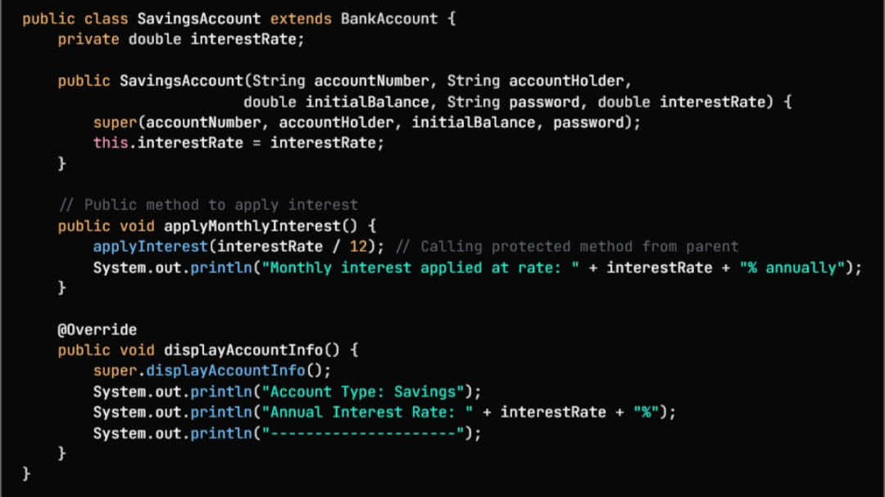
#### 3.3 Langkah Praktikum
1. Buat class AbstractionTest
serta method main() untuk menjalankan program.

2. Tampilkan judul demo
Print teks pembuka untuk menunjukkan demonstrasi abstraksi.

3. Buat dua objek akun

account1 → BankAccount biasa

account2 → SavingsAccount (punya bunga)

4. Uji fitur BankAccount

Tampilkan info akun

Lakukan deposit

Lakukan withdraw dengan password

Tampilkan info lagi

5. Uji fitur SavingsAccount

Tampilkan info

Terapkan bunga bulanan

Tampilkan info lagi

6. Uji transfer antar akun

Kirim uang dari account2 → account1

Tampilkan info kedua akun

7. Uji konsep abstraksi & access modifier

Tunjukkan bahwa field private tidak bisa diakses

Tunjukkan bahwa method private juga tidak bisa dipanggil

Tunjukkan method protected bisa dipakai oleh subclass (applyInterest)

8. Uji keamanan akun

Coba withdraw dengan password salah → harus gagal

Coba deposit dengan nilai tidak valid → harus ditolak

9. Tampilkan status akhir akun

Print info account1

Print info account2
#### Screenshoot Hasil
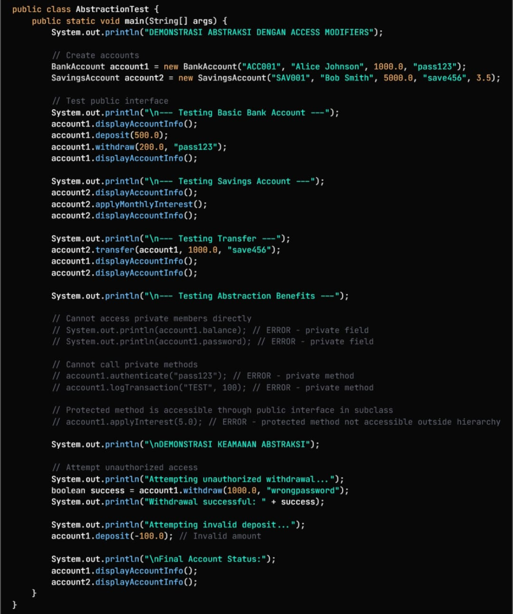
## 3. Kesimpulan
Pada praktikum ini, kamu mempelajari bagaimana abstraksi, interface, dan access modifier bekerja dalam pemrograman berorientasi objek. Seluruh percobaan menunjukkan bahwa abstraksi itu bukan cuma soal “menyembunyikan detail”, tapi juga membuat kode lebih aman, fleksibel, dan mudah dikembangkan.
Dari sisi abstract class, kamu belajar bagaimana sebuah kelas induk menyediakan kerangka umum (seperti perhitungan luas atau perimeter), sementara subclass-lah yang mengisi rincian implementasinya. Hal ini terbukti pada Shape, Circle, dan Rectangle yang mampu menunjukkan polymorphism secara nyata.
Pada bagian interface, kamu melihat bagaimana sebuah class bisa “mengadopsi” banyak kemampuan melalui kontrak method yang wajib diimplementasikan. Contohnya Vehicle dan Electric membuat Car dan ElectricCar mampu punya fitur yang berbeda tanpa bergantung pada pewarisan tunggal. Penggunaan default method, static method, dan batas kecepatan juga menunjukkan fleksibilitas interface.
Di bagian access modifier, kamu belajar bahwa pengaturan akses (private, protected, public) sangat penting untuk menjaga keamanan data. Pada kasus BankAccount, data sensitif seperti password sengaja disembunyikan agar tidak bisa diakses sembarangan. Transaksi hanya bisa dilakukan melalui method yang aman, dan method internal seperti authenticate() atau logTransaction() tetap terlindungi. Sementara subclass seperti SavingsAccount masih dapat memanfaatkan method protected untuk mengelola bunga.
Secara keseluruhan, praktikum ini menunjukkan bahwa abstraksi membuat program lebih terstruktur, lebih aman, dan lebih mudah dipelihara. Dengan memisahkan “apa yang boleh dilihat” dan “bagaimana cara kerja sebenarnya”, OOP menjadi jauh lebih powerful dan rapi saat digunakan pada sistem nyata seperti sistem bangun ruang, kendaraan, dan simulasi rekening bank.
## 4. Referensi
Petani Kode – Tutorial Java OOP: Abstraksi
https://www.petanikode.com/java-oop-abstraksi/
Duniailkom – Pemrograman Java OOP (Konsep Abstraksi)
https://www.duniailkom.com/tutorial-belajar-java-oop-pengertian-kelas-dan-object/